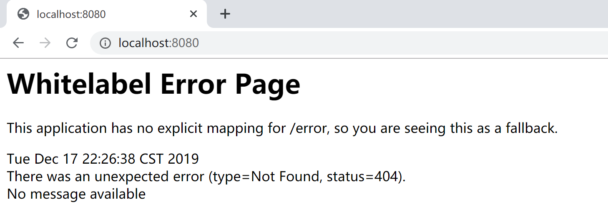
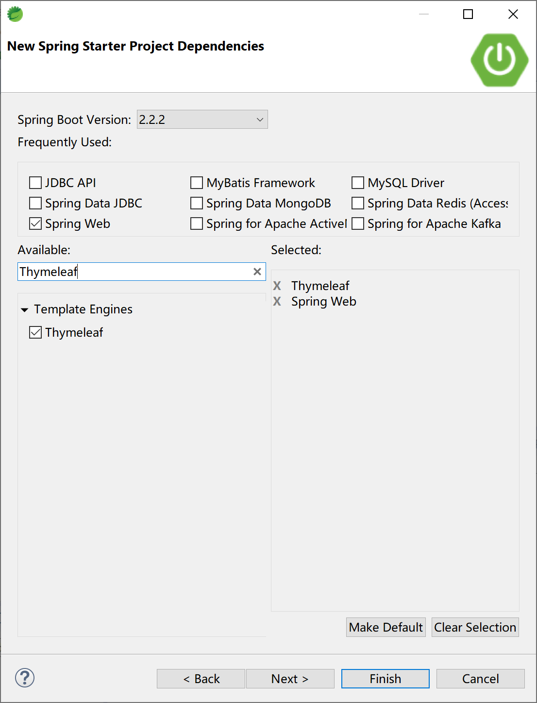
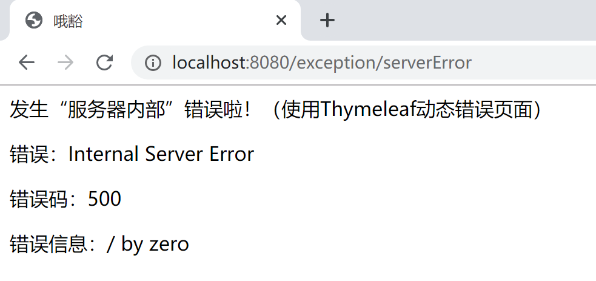
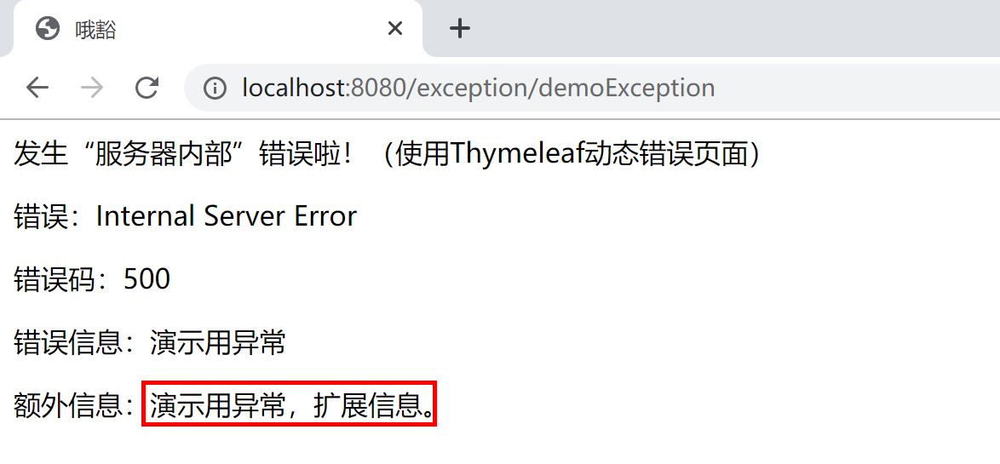

## 10.2 Spring Boot中全局异常的使用

在实际工作中，我们大部分时间在使用Spring Boot开发Web应用（当然，最经常使用到的是框架是Spring MVC）。由于和用户多有交互，所以在请求的过程中，发生错误异常是很常见的。Spring Boot为我们提供了一套默认的异常/错误处理机制，帮助我们来处理交互过程中的异常/错误。

> [官方文档](https://docs.spring.io/spring-boot/docs/current/reference/htmlsingle/#boot-features-error-handling)，对错误处理的描述如下：
>
> By default, Spring Boot provides an `/error` mapping that handles all errors in a sensible way, and it is registered as a “global” error page in the servlet container. For machine clients, it produces a JSON response with details of the error, the HTTP status, and the exception message. For browser clients, there is a “whitelabel” error view that renders the same data in HTML format (to customize it, add a `View` that resolves to `error`). To replace the default behavior completely, you can implement `ErrorController` and register a bean definition of that type or add a bean of type `ErrorAttributes` to use the existing mechanism but replace the contents.

例如，当我们通过浏览器访问一个不存在的url地址时，服务器就产生一个“404 Not Found”错误，Spring Boot提供的默认映射“/error”就起作用了，在这个请求中处理“404 Not Found”然后通过为该请求配置的默认全局错误页面来展示错误信息。

> Spring Boot默认在没有找到对应的Controller处理器方法（handler not found）的情况下，不会直接报错，而是通过向Servlet容器（如Tomcat）设置错误报告属性，然后Servlet容器发现错误（例如，http status=404），就查找默认“/error” 这个路径，Spring Boot就接管后续全局统一异常处理。



如果是通过Postman之类的工具以Post方式访问，Spring Boot的默认全局异常处理机制则会返回一段json信息。


### 10.2.1 Spring Boot默认全局异常

在Spring Boot提供的`org.springframework.boot.autoconfigure.web.servlet.error.ErrorMvcAutoConfiguration`类通过自动配置错误处理Bean，为Web容器提供了默认的全局异常处理机制。

```java
...
@Bean//1.DefaultErrorAttributes
@ConditionalOnMissingBean(value = ErrorAttributes.class, search = SearchStrategy.CURRENT)
public DefaultErrorAttributes errorAttributes() {
    return new DefaultErrorAttributes(this.serverProperties.getError().isIncludeException());
}

@Bean//2.BasicErrorController
@ConditionalOnMissingBean(value = ErrorController.class, search = SearchStrategy.CURRENT)
public BasicErrorController basicErrorController(ErrorAttributes errorAttributes,
                                                 ObjectProvider<ErrorViewResolver> errorViewResolvers) {
    return new BasicErrorController(errorAttributes, this.serverProperties.getError(),
                                    errorViewResolvers.orderedStream().collect(Collectors.toList()));
}

@Bean//3.ErrorPageCustomizer
public ErrorPageCustomizer errorPageCustomizer(DispatcherServletPath dispatcherServletPath) {
    return new ErrorPageCustomizer(this.serverProperties, dispatcherServletPath);
}
...
    
@Configuration(proxyBeanMethods = false)
static class DefaultErrorViewResolverConfiguration {

    private final ApplicationContext applicationContext;

    private final ResourceProperties resourceProperties;

    DefaultErrorViewResolverConfiguration(ApplicationContext applicationContext,
                                          ResourceProperties resourceProperties) {
        this.applicationContext = applicationContext;
        this.resourceProperties = resourceProperties;
    }

    @Bean//4.DefaultErrorViewResolver
    @ConditionalOnBean(DispatcherServlet.class)
    @ConditionalOnMissingBean(ErrorViewResolver.class)
    DefaultErrorViewResolver conventionErrorViewResolver() {
        return new DefaultErrorViewResolver(this.applicationContext, this.resourceProperties);
    }

}

@Configuration(proxyBeanMethods = false)
@ConditionalOnProperty(prefix = "server.error.whitelabel", name = "enabled", matchIfMissing = true)
@Conditional(ErrorTemplateMissingCondition.class)
protected static class WhitelabelErrorViewConfiguration {

    private final StaticView defaultErrorView = new StaticView();

    @Bean(name = "error")//将StaticView（就是Whitelabel错误页面）配置为error
    @ConditionalOnMissingBean(name = "error")
    public View defaultErrorView() {
        return this.defaultErrorView;
    }

...
```

#### 10.2.1.1 DefaultErrorAttributes

其中配置的`org.springframework.boot.web.servlet.error.DefaultErrorAttributes`类，为我们提供了在页面共享信息的“getErrorAttributes”方法。

```java
@Override
public Map<String, Object> getErrorAttributes(WebRequest webRequest, boolean includeStackTrace) {
    Map<String, Object> errorAttributes = new LinkedHashMap<>();
    errorAttributes.put("timestamp", new Date());
    addStatus(errorAttributes, webRequest);
    addErrorDetails(errorAttributes, webRequest, includeStackTrace);
    addPath(errorAttributes, webRequest);
    return errorAttributes;
}
```

#### 10.2.1.2 BasicErrorController
其中配置的`org.springframework.boot.autoconfigure.web.servlet.error.BasicErrorController`类，根据请求头的不同，提供了不同的方法处理默认/error请求。

- 普通html请求使用errorHtml方法，返回error错误页面并携带错误数据。
- 其他的请求（例如Postman发起的请求）使用error方法，返回json数据。

> @RequestMapping("${server.error.path:${error.path:/error}}")：这是一个三元写法，如果你在配置文件配置了server.error.path的话，就会使用你配置的异常处理地址，如果没有就会使用你配置的error.path路径地址，如果还是没有，默认使用/error来作为发生异常的处理地址。

```java
@Controller
@RequestMapping("${server.error.path:${error.path:/error}}")//拦截/error请求
public class BasicErrorController extends AbstractErrorController {
...
@RequestMapping(produces = MediaType.TEXT_HTML_VALUE)//处理浏览器请求，返回错误html页面
public ModelAndView errorHtml(HttpServletRequest request, HttpServletResponse response) {
    HttpStatus status = getStatus(request);
    Map<String, Object> model = Collections
        .unmodifiableMap(getErrorAttributes(request, isIncludeStackTrace(request, MediaType.TEXT_HTML)));
    response.setStatus(status.value());
    ModelAndView modelAndView = resolveErrorView(request, response, status, model);
    return (modelAndView != null) ? modelAndView : new ModelAndView("error", model);
}

@RequestMapping//处理“machine clients”请求，例如Postman发起的请求，返回json数据
public ResponseEntity<Map<String, Object>> error(HttpServletRequest request) {
    HttpStatus status = getStatus(request);
    if (status == HttpStatus.NO_CONTENT) {
        return new ResponseEntity<>(status);
    }
    Map<String, Object> body = getErrorAttributes(request, isIncludeStackTrace(request, MediaType.ALL));
    return new ResponseEntity<>(body, status);
}
```

例如，我们在浏览器中访问了一个不存在的url，Spring MVC将其错误信息封装到DefaultErrorAttributes（由getErrorAttributes方法提供数据），然后将其转发到“/error”请求，由BasicErrorController.errorHtml方法接管处理。


其中的`org.springframework.boot.autoconfigure.web.servlet.error.ErrorMvcAutoConfiguration.StaticView`类的“render”方法提供的就是我们经常能够看到的“Whitelabel Error Page”页面。

```java
private static class StaticView implements View {

    private static final MediaType TEXT_HTML_UTF8 = new MediaType("text", "html", StandardCharsets.UTF_8);

    private static final Log logger = LogFactory.getLog(StaticView.class);

    @Override
    public void render(Map<String, ?> model, HttpServletRequest request, HttpServletResponse response)
        throws Exception {
        if (response.isCommitted()) {
            String message = getMessage(model);
            logger.error(message);
            return;
        }
        response.setContentType(TEXT_HTML_UTF8.toString());
        StringBuilder builder = new StringBuilder();
        Date timestamp = (Date) model.get("timestamp");
        Object message = model.get("message");
        Object trace = model.get("trace");
        if (response.getContentType() == null) {
            response.setContentType(getContentType());
        }
        builder.append("<html><body><h1>Whitelabel Error Page</h1>").append(
            "<p>This application has no explicit mapping for /error, so you are seeing this as a fallback.</p>")
            .append("<div id='created'>").append(timestamp).append("</div>")
            .append("<div>There was an unexpected error (type=").append(htmlEscape(model.get("error")))
            .append(", status=").append(htmlEscape(model.get("status"))).append(").</div>");
        if (message != null) {
            builder.append("<div>").append(htmlEscape(message)).append("</div>");
        }
        if (trace != null) {
            builder.append("<div style='white-space:pre-wrap;'>").append(htmlEscape(trace)).append("</div>");
        }
        builder.append("</body></html>");
        response.getWriter().append(builder.toString());
    }
...
```

#### 10.2.1.3 ErrorPageCustomizer

其中的`org.springframework.boot.autoconfigure.web.servlet.error.ErrorMvcAutoConfiguration.ErrorPageCustomizer`类，在Spring Boot（Spring MVC）应用启动时，读取server.error.path配置属性，注册ErrorPage，在应用出现异常（比如404）时就能找到对应的页面（/error）进行处理。

```java
private static class ErrorPageCustomizer implements ErrorPageRegistrar, Ordered {

    private final ServerProperties properties;

    private final DispatcherServletPath dispatcherServletPath;

    protected ErrorPageCustomizer(ServerProperties properties, DispatcherServletPath dispatcherServletPath) {
        this.properties = properties;
        this.dispatcherServletPath = dispatcherServletPath;
    }

    @Override
    public void registerErrorPages(ErrorPageRegistry errorPageRegistry) {
        ErrorPage errorPage = new ErrorPage(
            this.dispatcherServletPath.getRelativePath(this.properties.getError().getPath()));
        //this.properties.getError().getPath()=server.error.path=error(默认值)
        errorPageRegistry.addErrorPages(errorPage);
    }

    @Override
    public int getOrder() {
        return 0;
    }

}
```

#### 10.2.1.4 DefaultErrorViewResolver

其中的`org.springframework.boot.autoconfigure.web.servlet.error.DefaultErrorViewResolver`类，完成默认的错误视图解析工作。

```java
@Override
public ModelAndView resolveErrorView(HttpServletRequest request, HttpStatus status, Map<String, Object> model) {
    ModelAndView modelAndView = resolve(String.valueOf(status.value()), model);
    if (modelAndView == null && SERIES_VIEWS.containsKey(status.series())) {
        modelAndView = resolve(SERIES_VIEWS.get(status.series()), model);
    }
    return modelAndView;
}

private ModelAndView resolve(String viewName, Map<String, Object> model) {
    //Spring Boot去找到一个处理错误的页面，例如error/404
    String errorViewName = "error/" + viewName;
    TemplateAvailabilityProvider provider = this.templateAvailabilityProviders.getProvider(errorViewName,
                                                                                           this.applicationContext);
    if (provider != null) {
        return new ModelAndView(errorViewName, model);
    }
    return resolveResource(errorViewName, model);
}
...
```

#### 10.2.1.5 全局异常处理过程

默认情况下，Web应用一旦出现错误，Spring Boot全局异常体系就接管该错误，并按照如下步骤进行处理：

1. 系统启动时ErrorPageCustomizer注册错误处理页面，并准备为异常服务；
2. 一但系统出现4xx或者5xx之类的错误，“/error”请求会被BasicErrorController处理，根据请求头的不同，返回页面或json数据；
3. 在返回页面的情况下，由DefaultErrorViewResolver解析得到由ErrorPageCustomizer注册的响应页面，如果没有指定页面，BasicErrorController就使用"error"视图；
4. "error"视图是由StaticView这个类提供的“Whitelabel Error Page”页面。

#### 10.2.1.6 跟踪代码，加深理解

为了理解Spring Boot在Spring MVC应用中提供的全局异常处理机制，建议读者以调试方式启动Spring Boot应用，通过浏览器访问一个不存在的地址（例如http://localhost:8080/good），跟踪代码，加深理解。

- 在`org.springframework.web.servlet.DispatcherServlet.doDispatch`方法处设置断点；
- 在`org.apache.catalina.core.StandardHostValve.status`方法处设置断点；
- 在`org.springframework.boot.autoconfigure.web.servlet.error.BasicErrorController.errorHtml`方法处设置断点；
- 在`org.springframework.boot.autoconfigure.web.servlet.error.DefaultErrorViewResolver.resolve`方法处设置断点；

然后跟踪代码：

1. 第1次进入doDispatch方法，是浏览器发起的，观察request的attributes中的值`org.springframework.web.servlet.HandlerMapping.lookupPath=/good`，DispatcherType=REQUEST；
2. 然后进入status方法，tomcat设置statusCode=404，ErrorPage[errorCode=0, location=/error]，然后转发错误请求“/error”；
3. 第2次进入doDispatch方法，观察request的dispatcherType=DispatcherType.ERROR，servletPath=/error；匹配的mappedHandler=org.springframework.boot.autoconfigure.web.servlet.error.BasicErrorController.errorHtml；
4. 后续就由errorHtml方法接管错误处理了。在`ModelAndView modelAndView = resolveErrorView(request, response, status, model)`查找对应的视图（view），我们没有指定视图的情况下返回null，然后在`return (modelAndView != null) ? modelAndView : new ModelAndView("error", model)`代码处为指定Model为“error”（ModelAndView("error", model)）；
5. 浏览器得到“Whitelabel Error Page”错误页面。

### 10.2.2 自定义全局异常

在SpringBoot 统一异常处理的做法主要有两种：一是使用注解**ExceptionHandler**处理某个特定的异常类，二是实现接口**ErrorController**或继承扩展**AbstractErrorController**类（BasicErrorController就继承自这个类）。

本小节使用“Thymeleaf模板引擎+Spring MVC”的Spring Boot应用，来讲解提供自定义错误页面进行如何优雅的全局异常处理。

源码参考spring-boot-exception项目。



#### 10.2.2.1 自定义错误页面

在resources/templates下面创建error.html页面，内容如下：

```html
<!DOCTYPE html>
<html xmlns:th="http://www.thymeleaf.org">
<head>
<meta charset="UTF-8">
<title>哦豁</title>
</head>
<body>
	发生错误啦！（使用Thymeleaf动态错误页面）
	<p th:text="${'错误：'+error}"></p>
	<p th:text="${'错误码：'+status}"></p>
	<p th:text="${'错误信息：'+message}"></p>
</body>
</html>
```

如果要细分错误码（如404，500）则在resources/templates/error下创建对应的页面，如500.html，内容如下：

```html
<!DOCTYPE html>
<html xmlns:th="http://www.thymeleaf.org">
<head>
<meta charset="UTF-8">
<title>哦豁</title>
</head>
<body>
	发生“服务器内部”错误啦！（使用Thymeleaf动态错误页面）
	<p th:text="${'错误：'+error}"></p>
	<p th:text="${'错误码：'+status}"></p>
	<p th:text="${'错误信息：'+message}"></p>
</body>
</html>
```

404.html：

```html
<!DOCTYPE html>
<html xmlns:th="http://www.thymeleaf.org">
<head>
<meta charset="UTF-8">
<title>哦豁</title>
</head>
<body>
	你访问的页面逃跑啦！（使用Thymeleaf动态错误页面）
	<p th:text="${'错误：'+error}"></p>
	<p th:text="${'错误码：'+status}"></p>
	<p th:text="${'错误信息：'+message}"></p>
</body>
</html>
```

通过一个Controller方法，内部除0发生异常，来测试500错误：

```java
package com.example.exception.foo.controller;

import org.springframework.web.bind.annotation.RequestMapping;
import org.springframework.web.bind.annotation.RestController;

@RestController
@RequestMapping("/exception/")
public class TestController {
	
	@RequestMapping("/serverError")
	public String serverError() {
		double d = 100/0;
		return "error" + d;
	}

}
```

浏览器访问[http://localhost:8080/exception/serverError](http://localhost:8080/exception/serverError)，由500.html响应的效果如下：



浏览器访问[http://localhost:8080/hello](http://localhost:8080/hello)，由404.html响应的效果如下：


#### 10.2.2.2 扩展DefaultErrorAttributes类

如果我们需要在错误发生的时候，生成（或提供）更多的信息，可以扩展Spring Boot提供的DefaultErrorAttributes类，在其中添加额外的错误信息。

```java
package com.example.exception.component;

import java.util.Map;

import org.springframework.boot.web.servlet.error.DefaultErrorAttributes;
import org.springframework.stereotype.Component;
import org.springframework.web.context.request.WebRequest;

@Component
public class ExErrorAttributes extends DefaultErrorAttributes {

	@Override
	public Map<String, Object> getErrorAttributes(WebRequest webRequest, boolean includeStackTrace) {
		Map<String, Object> errorAttributes = super.getErrorAttributes(webRequest, includeStackTrace);
// 从ExExceptionHandler中传递过来的额外异常信息，放入到errorAttributes中，供后续错误处理页面用。
		String msg = (String) webRequest.getAttribute("extErrorMsg", 0);
		errorAttributes.put("extErrorMsg", msg);
		return errorAttributes;
	}
}
```

#### 10.2.2.3 自定义异常处理类

创建一个异常类DemoException，用来演示抛出异常。

```java
package com.example.exception.component;

public class DemoException extends RuntimeException {

	private static final long serialVersionUID = -9185062164416168469L;

	public DemoException() {
		super("演示用异常");
	}
}
```

自定义一个异常处理类，专门处理DemoException异常：

```java
package com.example.exception.component;

import javax.servlet.http.HttpServletRequest;

import org.springframework.web.bind.annotation.ControllerAdvice;
import org.springframework.web.bind.annotation.ExceptionHandler;

@ControllerAdvice
public class ExExceptionHandler {

	@ExceptionHandler(DemoException.class)
	public String handleException(Exception e, HttpServletRequest request) {
		request.setAttribute("javax.servlet.error.status_code", 500);
		request.setAttribute("extErrorMsg", "演示用异常，扩展信息。");
		return "forward:/error";
	}

}
```

#### 102.2.4 测试

在控制器TestController中添加一个方法，其内部抛出DemoException，测试。

```java
package com.example.exception.foo.controller;

import org.springframework.web.bind.annotation.RequestMapping;
import org.springframework.web.bind.annotation.RestController;

import com.example.exception.component.DemoException;

@RestController
@RequestMapping("/exception/")
public class TestController {
	
	@RequestMapping("/demoException")
	public String serverError() {
		throw new DemoException();
	}

	@RequestMapping("/serverError")
	public String serverError2() {
		double d = 100/0;
		return "error" + d;
	}
}
```

打开浏览器访问[http://localhost:8080/exception/demoException](http://localhost:8080/exception/demoException)，验证自定义异常的处理效果。



使用Postman发起请求，同样能够得到期望的异常信息。

