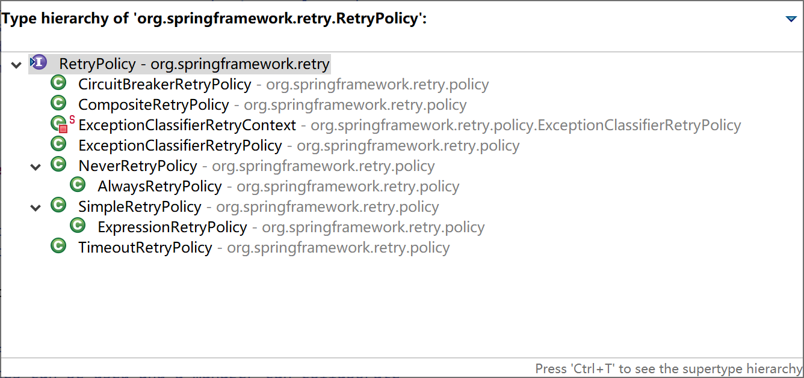
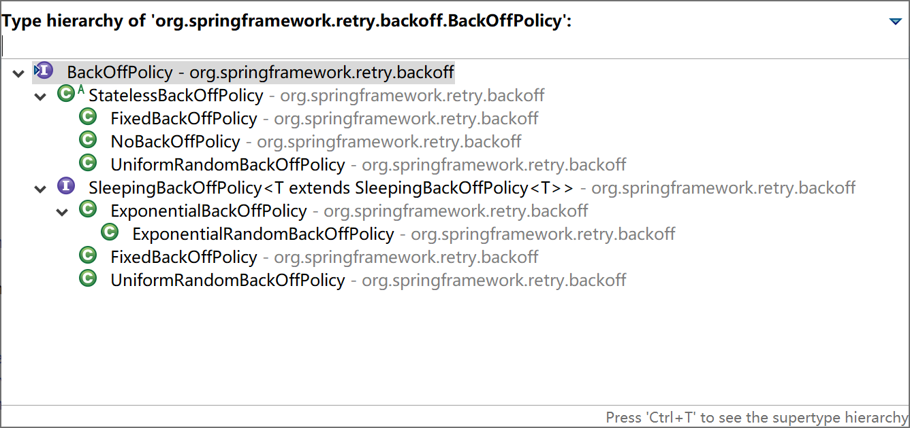
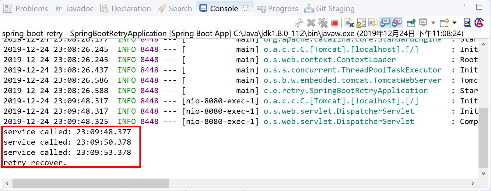
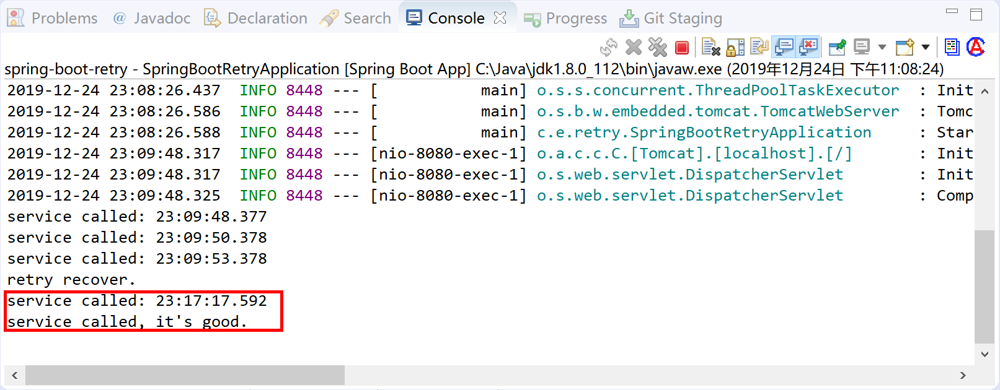

## 10.3 异常的重试

在实际项目中，有些业务场景需要我们对一些异常情况下的任务进行重试，比如：调用第三方接口RPC服务，可能由于网络抖动、连接超时等网络异常，多尝试几次就可以恢复正常。

如果我们要做重试，为特定的某个操作提供重试功能，就需要硬编码。大概逻辑基本都是写个循环，根据返回或异常，计数失败的次数，然后设定退出条件。这样做，每个操作都要写这种类似的代码，而且重试逻辑和业务逻辑混在一起，给维护和扩展带来了麻烦。从面向对象和面向方面（AOP）的角度来看，我们应该把重试的代码独立出来。

Spring提供的独立出来的重试框架就是[spring-retry](https://github.com/spring-projects/spring-retry)项目，它是从Spring Batch（从2.2.0版本中独立出来）中独立出来的一个项目，主要实现了重试和熔断，被用到Spring Batch、Spring Integration等项目中。

> This project provides declarative retry support for Spring applications. It is used in Spring Batch, Spring Integration, and others. Imperative retry is also supported for explicit usage.

spring-retry对于重试是有场景限制的，不是什么场景都适合重试，比如参数校验不合法、写操作等（要考虑写是否幂等）都不适合重试。远程调用超时、网络突然中断可以重试。在微服务治理框架中，通常都有自己的重试与超时配置，比如dubbo可以设置retries=1，timeout=500调用失败只重试1次，超过500ms调用仍未返回则调用失败。在spring retry中可以指定需要重试的异常类型，并设置每次重试的间隔以及如果重试失败是继续重试还是熔断（停止重试）。

### 10.3.1 重试策略

spring-retry通过接口RetryPolicy（重试策略）及其8个实现类提供了8种重试策略。



- **NeverRetryPolicy：**只允许调用RetryCallback一次，不允许重试；
- **AlwaysRetryPolicy：**允许无限重试，直到成功，此方式逻辑不当会导致死循环；
- **SimpleRetryPolicy：**固定次数重试策略，默认重试最大次数为3次，是RetryTemplate默认使用的策略；
- **ExpressionRetryPolicy：**表达式重试策略，符合表达式就会重试；
- **TimeoutRetryPolicy：**超时时间重试策略，默认超时时间为1秒，在指定的超时时间内允许重试；
- **ExceptionClassifierRetryPolicy：**设置不同异常的重试策略，类似组合重试策略，区别在于这里只区分不同异常的重试；
- **CircuitBreakerRetryPolicy：**有熔断功能的重试策略，需设置3个参数openTimeout、resetTimeout和delegate，如果不在熔断状态，则允许重试；
- **CompositeRetryPolicy：**组合重试策略，有两种组合方式，乐观组合重试策略是指只要有一个策略允许重试即可以重试，悲观组合重试策略是指只要有一个策略不允许重试即不可以重试，但不管哪种组合方式，组合中的每一个策略都会执行。

### 10.3.2 退避策略

两次重试之间需要立即重试还是等待一段时间后重试，就是退避策略。

比如发生网络错误，立即重试将导致立即失败，最好的办法是等待一小段时间后重试，这还可以防止很多服务同时重试导致的DDoS（Distributed Denial of Service）。

spring-retry通过接口BackOffPolicy（退避策略）及其5个实现类提供了5种退避策略。



- **FixedBackOffPolicy：**固定时间的退避策略，需设置参数sleeper和backOffPeriod，sleeper指定等待策略，默认是Thread.sleep，即线程休眠，backOffPeriod指定休眠时间，默认1秒；
- **NoBackOffPolicy：**无退避算法策略，即需要重试时立即重试；
- **UniformRandomBackOffPolicy：**随机时间退避策略，需设置sleeper、minBackOffPeriod和maxBackOffPeriod，该策略在[minBackOffPeriod, maxBackOffPeriod]之间取一个随机休眠时间，minBackOffPeriod默认500毫秒，maxBackOffPeriod默认1500毫秒；
- **ExponentialBackOffPolicy：**指数退避策略，需设置参数sleeper、initialInterval、maxInterval和multiplier，initialInterval指定初始休眠时间，默认100毫秒，maxInterval指定最大休眠时间，默认30秒，multiplier指定乘数，即下一次休眠时间为当前休眠时间*multiplier；
- **ExponentialRandomBackOffPolicy：**随机指数退避策略，引入随机乘数，相对ExponentialBackOffPolicy和FixedBackOffPolicy可能会引起很多服务同时重试导致DDoS，使用随机休眠时间就可以避免这种情况。

### 10.3.3 无状态重试

在最简单的情况下，重试只是一个while循环：RetryTemplate可以一直尝试，直到成功或失败。RetryContext包含一些状态以确定是重试还是中止。但是，这个状态在堆栈上，不需要在全局任何地方存储它。因此，我们称之为无状态重试。无状态重试和有状态重试之间的区别包含在RetryPolicy的实现中（RetryTemplate可以处理这两者）。在无状态重试中，回调始终在重试失败时的同一线程中执行。

### 10.3.4 有状态重试

无状态重试情况下产生异常，并不会将其抛出去，这对于事务性调用，是不可容忍的，因为上层框架需要获得异常进行事务的回滚操作。这个时候就应当使用有状态重试。

```java
BinaryExceptionClassifier classifier = 
    new BinaryExceptionClassifier(Collections.singleton(Throwable.class));
RetryState state = new DefaultRetryState("mykey", false, classifier);
String result = template.execute((RetryCallback<String, Throwable>)context -> {
    remoteInvoke();
    return "ret";
}, context -> {
	return "recovery";
}, state);
```

事务的开销一般较大，这里虽然能够有状态重试进行事务的回滚，但并不建议去进行事务的重试，而应当使用failfast机制，可能更加合理一些。

### 10.3.5 声明式重试

spring-retry官方给出了最简单的声明式重试代码示例。通过@EnableRetry、@Retryable和@Recover注解完成声明式重试的代码的编写。

```java
@Configuration
@EnableRetry
public class Application {

    @Bean
    public Service service() {
        return new Service();
    }

}

@Service
class Service {
    @Retryable(RemoteAccessException.class)
    public void service() {
        // ... do something
    }
    @Recover
    public void recover(RemoteAccessException e) {
       // ... panic
    }
}
```

以上代码：在调用service方法时，如果发生RemoteAccessException异常就开始重试（默认重试策略，重试3次），如果重试不成功，则调用recover方法。

### 10.3.6 命令式重试

spring-retry官方给出了最简单的命令式重试代码示例。

命令式重试使用Spring一贯的API风格：RetryTemplate模板实现，是线程安全的。

RetryTemplate将重试、熔断功能封装到模板中，提供健壮和不易出错的API供我们使用。

```java
RetryTemplate template = RetryTemplate.builder()
				.maxAttempts(3)
				.fixedBackoff(1000)
				.retryOn(RemoteAccessException.class)
				.build();

template.execute(ctx -> {
    // ... do something
});
```

### 10.3.7 在Spring Boot中使用spring-retry

新建Spring Boot web应用，在pom文件种添加spring-retry和aspectjweaver依赖。

```xml
<dependency>
    <groupId>org.springframework.boot</groupId>
    <artifactId>spring-boot-starter-web</artifactId>
</dependency>
<dependency>
    <groupId>org.springframework.retry</groupId>
    <artifactId>spring-retry</artifactId>
</dependency>
<dependency>
    <groupId>org.aspectj</groupId >
    <artifactId>aspectjweaver</artifactId >
</dependency>
```

在Spring Boot启动类上使用注解@EnableRetry打开重试配置。

```java
package com.example.retry;

import org.springframework.boot.SpringApplication;
import org.springframework.boot.autoconfigure.SpringBootApplication;
import org.springframework.retry.annotation.EnableRetry;

@SpringBootApplication
@EnableRetry
public class SpringBootRetryApplication {

	public static void main(String[] args) {
		SpringApplication.run(SpringBootRetryApplication.class, args);
	}

}
```

添加重试服务类RetryService，在service方法上标注@Retryable，在recover方法上标注@Recover。

```java
package com.example.retry.service;

import java.time.LocalTime;

import org.springframework.retry.annotation.Backoff;
import org.springframework.retry.annotation.Recover;
import org.springframework.retry.annotation.Retryable;
import org.springframework.stereotype.Service;

@Service
public class RetryService {

	@Retryable(value = Exception.class, maxAttempts = 3, backoff = @Backoff(delay = 2000, multiplier = 1.5))
	public int service(int code) throws Exception {
		System.out.println("service called: " + LocalTime.now());
		if (code == 0) {
			throw new Exception("EXCCEPTION: It's bad.");
		}
		System.out.println("service called, it's good.");
		return 200;
	}
	
	@Recover
    public int recover(Exception e){
        System.out.println("retry recover.");
        return 500;
    }

}
```

添加控制器RetryController类，与用户进行交互。

```java
package com.example.retry.controller;

import org.springframework.beans.factory.annotation.Autowired;
import org.springframework.web.bind.annotation.RequestMapping;
import org.springframework.web.bind.annotation.RestController;

import com.example.retry.service.RetryService;

@RestController
@RequestMapping("/retry/")
public class RetryController {
	
	@Autowired 
	RetryService service;
	
	@RequestMapping("/service")
	public String service(int code) throws Exception {
		int result = service.service(code);
		return "spring-retry in Spring Boot: "+ result;
	}

}
```

打开浏览器，输入[http://localhost:8080/retry/service?code=0](http://localhost:8080/retry/service?code=0)地址，通过传入code=0这个参数，触发异常重试，测试。


通过后台观察，重试了3次，最后调用了@Recover标注的方法。



打开浏览器，输入[http://localhost:8080/retry/service?code=6998](http://localhost:8080/retry/service?code=6998)地址，通过传入code=6998这个参数，不触发异常，调用服务不需要重试，测试。


通过后台观察，没有异常，没有重试，程序代码逻辑正常。

