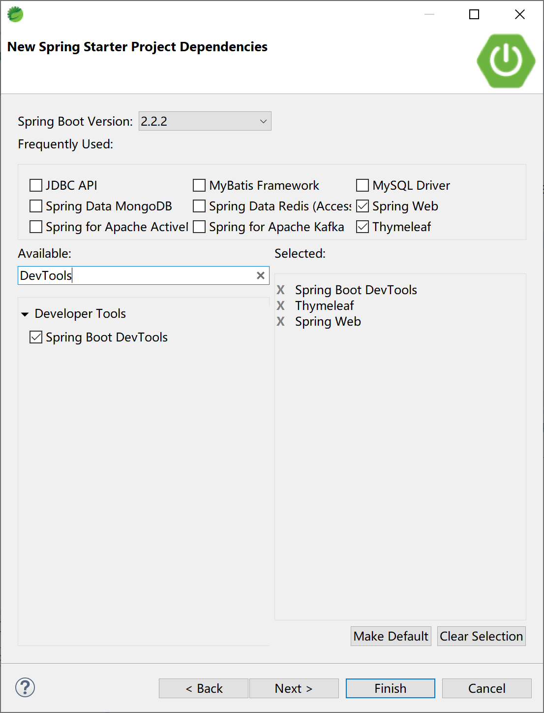

## 11.1 Spring Boot中的单元测试

单元测试是指对软件中的最小可测试单元进行检查和验证，单元测试归属于白盒测试。

这个定义有点抽象，下面举几个单元测试的特性，大家感受一下：

- 一般是一个函数配几个单元测试；
- 单元测试不应该依赖外部系统；
- 单元测试运行速度很快；
- 单元测试不应该造成测试环境的脏数据；
- 单元测试可以重复运行。

单元测试使得我们可以放心修改、重构业务代码，而不用担心修改某处代码后带来的副作用。

单元测试可以帮助我们反思模块划分的合理性，如果一个单元测试写得逻辑非常复杂、或者说一个函数复杂到无法写单元测试，那就说明模块的抽象有问题。

单元测试使得系统具备更好的可维护性、具备更好的可读性。对于团队的新人来说，阅读系统代码可以从单元测试入手，一点点开始熟悉系统的逻辑。

优秀的开源框架，都配有完善的单元测试套件（Test Suite）。

越是底层的代码，越是被更多客户调用的代码，越应该实践TDD（Test-Driven Development，测试驱动开发）。

> 测试驱动开发的基本思想就是在开发功能代码之前，先编写测试代码。也就是说在明确要开发某个功能后，首先思考如何对这个功能进行测试，并完成测试代码的编写，然后编写相关的代码满足这些测试用例。然后循环进行添加其他功能，直到完全部功能的开发。

虽然，我们日常工作中不会为每一段业务逻辑（类或方法）提供单元测试，但是针对大部分的产品级业务系统（主要工作是再某一技术基础平台上实现业务逻辑），都应该写单元测试。

大部分开发人员使用的单元测试框架都是JUnit，这也是Spring Boot的选择。

