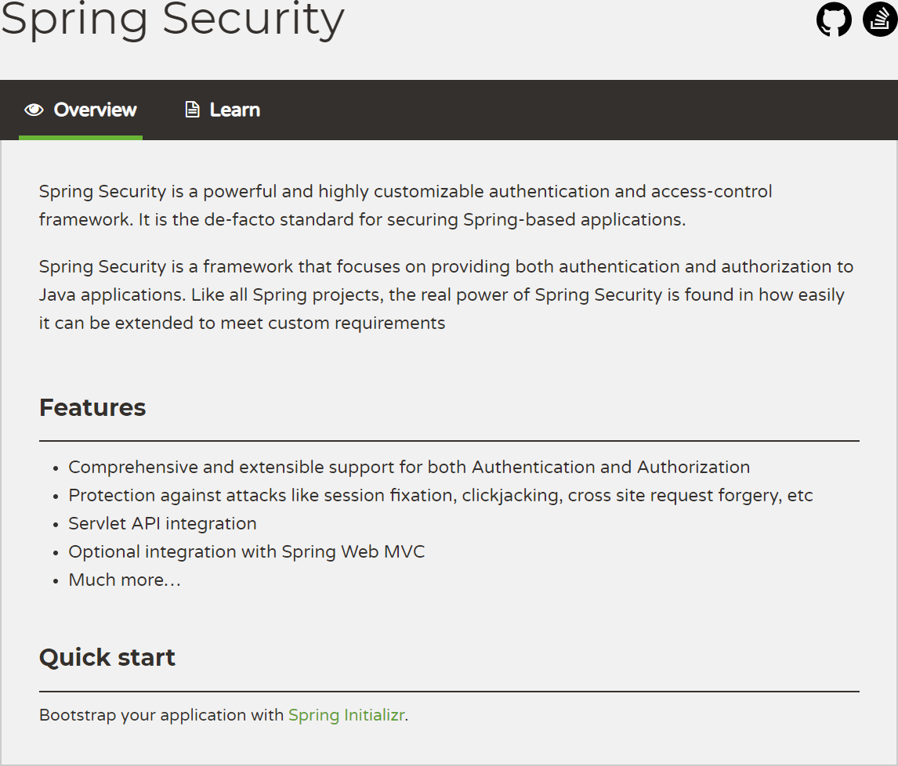

## 12.1 Spring Security介绍

Spring Security 以“The Acegi Secutity System for Spring” 的名字始于2003年年底。第一个正式版本1.0.0版发布于2006年5月。Acegi在2007年年底，正式成为spring组合项目，被更名为“Spring Security”。

现在，Spring Security成为了一个强大而又活跃的开源社区。 在Spring Security支持论坛上有成千上万的信息。 有一个积极的核心开发团队专职进行开发，一个积极的社区定期共享补丁并支持他们的同伴。



[Spring Security](https://docs.spring.io/spring-security/site/docs/5.2.1.RELEASE/reference/htmlsingle/)是一个功能强大、高度可定制的身份验证和访问控制框架。它是保护基于Spring应用的事实上的标准。当前最新版本为[5.2.1.RELEASE](https://github.com/spring-projects/spring-security/tree/5.2.1.RELEASE)版。

Spring Security是一个专注于为Java应用程序提供身份验证和授权的框架。与所有Spring项目一样，Spring Security的真正威力在于它可以很容易地扩展来满足定制化需求。

其特性有：

- 全面和可扩展的身份验证和授权支持；

- 防止会话固定攻击、点击劫持、伪造跨站点请求等攻击；

- Servlet API集成；

- 与Spring Web MVC的可选集成；

- 更多…

> 会话固定攻击（session fixation attack）是利用应用系统在服务器的会话ID固定不变机制，借助他人用相同的会话ID获取认证和授权，然后利用该会话ID劫持他人的会话以成功冒充他人，造成会话固定攻击。

下面我们对Spring Security 原理进行简要的分析。

### 12.1.1 过滤器链

SpringSecurity 采用的是责任链的设计模式，它有一条很长的过滤器链。现在对这条过滤器链的各个进行说明：

1. WebAsyncManagerIntegrationFilter：将 Security 上下文与 Spring Web 中用于处理异步请求映射的 WebAsyncManager 进行集成。

2. SecurityContextPersistenceFilter：在每次请求处理之前将该请求相关的安全上下文信息加载到 SecurityContextHolder 中，然后在该次请求处理完成之后，将 SecurityContextHolder 中关于这次请求的信息存储到一个“仓储”中，然后将 SecurityContextHolder 中的信息清除，例如在Session中维护一个用户的安全信息就是这个过滤器处理的。

3. HeaderWriterFilter：用于将头信息加入响应中。

4. CsrfFilter：用于处理跨站请求伪造。

5. LogoutFilter：用于处理退出登录。

6. UsernamePasswordAuthenticationFilter：用于处理基于表单的登录请求，从表单中获取用户名和密码。默认情况下处理来自 /login 的请求。从表单中获取用户名和密码时，默认使用的表单 name 值为 username 和 password，这两个值可以通过设置这个过滤器的usernameParameter 和 passwordParameter 两个参数的值进行修改。

7. DefaultLoginPageGeneratingFilter：如果没有配置登录页面，那系统初始化时就会配置这个过滤器，并且用于在需要进行登录时生成一个登录表单页面。

8. BasicAuthenticationFilter：检测和处理 http basic 认证。

9. RequestCacheAwareFilter：用来处理请求的缓存。

10. SecurityContextHolderAwareRequestFilter：主要是包装请求对象request。

11. AnonymousAuthenticationFilter：检测 SecurityContextHolder 中是否存在 Authentication 对象，如果不存在为其提供一个匿名 Authentication。

12. SessionManagementFilter：管理 session 的过滤器

13. ExceptionTranslationFilter：处理 AccessDeniedException 和 AuthenticationException 异常。

14. FilterSecurityInterceptor：可以看做过滤器链的出口。

15. RememberMeAuthenticationFilter：当用户没有登录而直接访问资源时, 从 cookie 里找出用户的信息, 如果 Spring Security 能够识别出用户提供的remember me cookie, 用户将不必填写用户名和密码, 而是直接登录进入系统，该过滤器默认不开启。
    
### 12.1.2 流程

先来看下面一个 Spring Security 执行流程图，只要把 SpringSecurity 的执行过程弄明白了，这个框架就会变得很简单：


1. 客户端发起一个请求，进入 Security 过滤器链。

2. 当到 LogoutFilter 的时候判断是否是登出路径，如果是登出路径则到 logoutHandler ，如果登出成功则到 logoutSuccessHandler 登出成功处理，如果登出失败则由 ExceptionTranslationFilter ；如果不是登出路径则直接进入下一个过滤器。

3. 当到 UsernamePasswordAuthenticationFilter 的时候判断是否为登录路径，如果是，则进入该过滤器进行登录操作，如果登录失败则到 AuthenticationFailureHandler 登录失败处理器处理，如果登录成功则到 AuthenticationSuccessHandler 登录成功处理器处理，如果不是登录请求则不进入该过滤器。

4. 当到 FilterSecurityInterceptor 的时候会拿到 uri ，根据 uri 去找对应的鉴权管理器，鉴权管理器做鉴权工作，鉴权成功则到 Controller 层否则到 AccessDeniedHandler 鉴权失败处理器处理。

### 12.1.3 配置

在 `WebSecurityConfigurerAdapter` 这个类里面可以完成上述流程图的所有配置。

配置类伪代码：

```java
@Configuration	
@EnableWebSecurity	
public class SecurityConfig extends WebSecurityConfigurerAdapter {	
    @Override	
    protected void configure(AuthenticationManagerBuilder auth) throws Exception {	
        auth.userDetailsService(userDetailService).passwordEncoder(new BCryptPasswordEncoder());	
    }	
    @Override	
    public void configure(WebSecurity web) throws Exception {	
        web.ignoring().antMatchers("/resources/**/*.html", "/resources/**/*.js");	
    }	
    @Override	
    protected void configure(HttpSecurity http) throws Exception {	
       http	
       .formLogin()	
       .loginPage("/login_page")	
       .passwordParameter("username")	
       .passwordParameter("password")	
       .loginProcessingUrl("/sign_in")	
       .permitAll()	
       .and().authorizeRequests().antMatchers("/test").hasRole("test")	
       .anyRequest().authenticated().accessDecisionManager(accessDecisionManager())	
       .and().logout().logoutSuccessHandler(new MyLogoutSuccessHandler())	
       .and().csrf().disable();	
       http.addFilterAt(getAuthenticationFilter(),UsernamePasswordAuthenticationFilter.class);	
       http.exceptionHandling().accessDeniedHandler(new MyAccessDeniedHandler());	
       http.addFilterAfter(new MyFittler(), LogoutFilter.class);	
    }	
}
```

配置简介

- configure(AuthenticationManagerBuilder auth)

  AuthenticationManager 的建造器，配置 AuthenticationManagerBuilder 会让Security 自动构建一个 AuthenticationManager（该类的功能参考流程图）；如果想要使用该功能你需要配置一个 UserDetailService 和 PasswordEncoder。UserDetailsService 用于在认证器中根据用户传过来的用户名查找一个用户， PasswordEncoder 用于密码的加密与比对，我们存储用户密码的时候用PasswordEncoder.encode() 加密存储，在认证器里会调用 PasswordEncoder.matches() 方法进行密码比对。如果重写了该方法，Security 会启用 DaoAuthenticationProvider 这个认证器，该认证就是先调用 UserDetailsService.loadUserByUsername 然后使用 PasswordEncoder.matches() 进行密码比对，如果认证成功成功则返回一个 Authentication 对象。

- configure(WebSecurity web)

  这个配置方法用于配置静态资源的处理方式，可使用 Ant 匹配规则。

- configure(HttpSecurity http)

  这个配置方法是最关键的方法，也是最复杂的方法。我们慢慢掰开来说：

    ```java
    http	
    .formLogin()	
    .loginPage("/login_page")	
    .passwordParameter("username")	
    .passwordParameter("password")	
    .loginProcessingUrl("/sign_in")	
    .permitAll()
    ```

  这是配置登录相关的操作从方法名可知，配置了登录页请求路径，密码属性名，用户名属性名，和登录请求路径，permitAll()代表任意用户可访问。

    ```java
    http	
    .authorizeRequests()	
    .antMatchers("/test").hasRole("test")	
    .anyRequest().authenticated()	
    .accessDecisionManager(accessDecisionManager());
    ```

  以上配置是权限相关的配置，配置了一个 /test url 该有什么权限才能访问， anyRequest() 表示所有请求，authenticated() 表示已登录用户才能访问， accessDecisionManager() 表示绑定在 url 上的鉴权管理器

  为了对比，现在贴出另一个权限配置清单：

    ```java
    http.authorizeRequests()	
    .antMatchers("/tets_a/**","/test_b/**").hasRole("test")	
    .antMatchers("/a/**","/b/**").authenticated()	
    .accessDecisionManager(accessDecisionManager())
    ```

  我们可以看到权限配置的自由度很高，鉴权管理器可以绑定到任意 url 上；而且可以硬编码各种 url 权限：

    ```java
    http	
    .logout()	
    .logoutUrl("/logout")	
    .logoutSuccessHandler(new MyLogoutSuccessHandler())
    ```

  登出相关配置，这里配置了登出 url 和登出成功处理器：

    ```java
    http	
    .exceptionHandling()	
    .accessDeniedHandler(new MyAccessDeniedHandler());
    ```

  上面代码是配置鉴权失败的处理器。

    ```java
    http.addFilterAfter(new MyFittler(), LogoutFilter.class);	
    http.addFilterAt(getAuthenticationFilter(),UsernamePasswordAuthenticationFilter.class);
    ```

  上面代码展示如何在过滤器链中插入自己的过滤器，addFilterBefore 加在对应的过滤器之前，addFilterAfter 加在对应的过滤器之后，addFilterAt 加在过滤器同一位置，事实上框架原有的 Filter 在启动 HttpSecurity 配置的过程中，都由框架完成了其一定程度上固定的配置，是不允许更改替换的。根据测试结果来看，调用 addFilterAt 方法插入的 Filter ，会在这个位置上的原有 Filter 之前执行。

    > 关于 HttpSecurity 使用的是链式编程，其中 http.xxxx.and.yyyyy 这种写法和 http.xxxx;http.yyyy 写法意义一样。

- 自定义 AuthenticationManager 和 AccessDecisionManager

  重写 authenticationManagerBean() 方法，并构造一个 authenticationManager：

  ```java
  @Override	
  public AuthenticationManager authenticationManagerBean() throws Exception {	
      ProviderManager authenticationManager = new ProviderManager(Arrays.asLis(getMyAuthenticationProvider(),daoAuthenticationProvider()));	
      return authenticationManager;	
  }
  ```

  我这里给 authenticationManager 配置了两个认证器，执行过程参考流程图。

  定义构造AccessDecisionManager的方法并在配置类中调用，配置参考 configure(HttpSecurity http) 说明：

  ```java
  public AccessDecisionManager accessDecisionManager(){	
      List<AccessDecisionVoter<? extends Object>> decisionVoters	
              = Arrays.asList(	
              new MyExpressionVoter(),	
              new WebExpressionVoter(),	
              new RoleVoter(),	
              new AuthenticatedVoter());	
      return new UnanimousBased(decisionVoters);	
  }
  ```

  投票管理器会收集投票器投票结果做统计，最终结果大于等于0代表通过；每个投票器会返回三个结果：-1（反对），0（通过），1（赞成）。

### 12.1.4 权限系统

- UserDetails

  Security 中的用户接口，我们自定义用户类要实现该接口。

- GrantedAuthority

  Security 中的用户权限接口，自定义权限需要实现该接口:

  ```java
  public class MyGrantedAuthority implements GrantedAuthority {	
      private String authority;	
  }
  ```

  authority 表示权限字段，需要注意的是在 config 中配置的权限会被加上 ROLE_ 前缀，比如我们的配置 `authorizeRequests().antMatchers("/test").hasRole("test")`，配置了一个 test 权限但我们存储的权限字段（authority）应该是 ROLE_test 。

- UserDetailsService

  Security 中的用户 Service，自定义用户服务类需要实现该接口：

  ```java
  @Service	
  public class MyUserDetailService implements UserDetailsService {	
      @Override	
      public UserDetails loadUserByUsername(String s) throws UsernameNotFoundException {	
        return.....	
      }	
  }
  ```

  loadUserByUsername的作用在上文中已经说明，就是根据用户名查询用户对象。

- SecurityContextHolder

  用户在完成登录后 Security 会将用户信息存储到这个类中，之后其他流程需要得到用户信息时都是从这个类中获得，用户信息被封装成 SecurityContext ，而实际存储的类是 SecurityContextHolderStrategy ，默认的SecurityContextHolderStrategy 实现类是 ThreadLocalSecurityContextHolderStrategy 它使用了ThreadLocal来存储了用户信息。

  手动填充 SecurityContextHolder 示例：

  ```java
  UsernamePasswordAuthenticationToken token = new UsernamePasswordAuthenticationToken("test","test",list);	
  SecurityContextHolder.getContext().setAuthentication(token);
  ```

  对于使用 token 鉴权的系统，我们就可以验证token后手动填充SecurityContextHolder，填充时机只要在执行投票器之前即可，或者干脆可以在投票器中填充，然后在登出操作中清空SecurityContextHolder。

### 12.1.5 扩展

Security 可扩展的有：

1. 鉴权失败处理器

2. 验证器

3. 登录成功处理器

4. 投票器

5. 自定义token处理过滤器

6. 登出成功处理器

7. 登录失败处理器

8. 自定义 UsernamePasswordAuthenticationFilter


- 鉴权失败处理器

  Security 鉴权失败默认跳转登录页面，我们可以实现 AccessDeniedHandler 接口，重写 handle() 方法来自定义处理逻辑；然后参考配置类说明将处理器加入到配置当中。

- 验证器

  实现 AuthenticationProvider 接口来实现自己验证逻辑。需要注意的是在这个类里面就算你抛出异常，也不会中断验证流程，而是算你验证失败，我们由流程图知道，只要有一个验证器验证成功，就算验证成功，所以你需要留意这一点。

- 登录成功处理器

  在 Security 中验证成功默认跳转到上一次请求页面或者路径为 "/" 的页面，我们同样可以自定义：继承 SimpleUrlAuthenticationSuccessHandler 这个类或者实现 AuthenticationSuccessHandler 接口。我这里建议采用继承的方式,SimpleUrlAuthenticationSuccessHandler 是默认的处理器，采用继承可以契合里氏替换原则，提高代码的复用性和避免不必要的错误。

- 投票器

  投票器可继承 WebExpressionVoter 或者实现 AccessDecisionVoter接口；WebExpressionVoter 是 Security 默认的投票器；我这里同样建议采用继承的方式；添加到配置的方式参考 上文；

  注意：投票器 vote 方法返回一个int值；-1代表反对，0代表弃权，1代表赞成；投票管理器收集投票结果，如果最终结果大于等于0则放行该请求。

- 自定义token处理过滤器

  自定义 token 处理器继承自 OncePerRequestFilter 或者 GenericFilterBean 或者 Filter 都可以，在这个处理器里面需要完成的逻辑是：获取请求里的 token，验证 token 是否合法然后填充 SecurityContextHolder ，虽然说过滤器只要添加在投票器之前就可以，但我这里还是建议添加在 http.addFilterAfter(new MyFittler(), LogoutFilter.class);

- 登出成功处理器

  实现LogoutSuccessHandler接口，添加到配置的方式参考上文。

- 登录失败处理器

  登录失败默认跳转到登录页，我们同样可以自定义。继承 SimpleUrlAuthenticationFailureHandler 或者实现 AuthenticationFailureHandler，建议采用继承。

- 自定义UsernamePasswordAuthenticationFilter

  我们自定义UsernamePasswordAuthenticationFilter可以极大提高我们 Security的灵活性（比如添加验证验证码是否正确的功能）。

  我们直接继承 UsernamePasswordAuthenticationFilter ，然后在配置类中初始化这个过滤器，给这个过滤器添加登录失败处理器，登录成功处理器，登录管理器，登录请求 url 。

  这里配置略微复杂，贴一下代码清单

  初始化过滤器：

  ```java
  MyUsernamePasswordAuthenticationFilte getAuthenticationFilter(){	
      MyUsernamePasswordAuthenticationFilter myUsernamePasswordAuthenticationFilter = new MyUsernamePasswordAuthenticationFilter(redisService);	
      myUsernamePasswordAuthenticationFilter.setAuthenticationFailureHandler(new MyUrlAuthenticationFailureHandler());	
      myUsernamePasswordAuthenticationFilter.setAuthenticationSuccessHandler(new MyAuthenticationSuccessHandler());	
      myUsernamePasswordAuthenticationFilter.setFilterProcessesUrl("/sign_in");	
      myUsernamePasswordAuthenticationFilter.setAuthenticationManager(getAuthenticationManager());	
      return myUsernamePasswordAuthenticationFilter;	
  }
  ```

  添加到配置：

  ```java
  http.addFilterAt(getAuthenticationFilter(),UsernamePasswordAuthenticationFilter.class);
  ```

### 12.1.6 总结

对于 Security 的扩展配置关键在于 `configure(HttpSecurityhttp)` 方法；扩展认证方式可以自定义 authenticationManager 并加入自己验证器，在验证器中抛出异常不会终止验证流程；扩展鉴权方式可以自定义 accessDecisionManager 然后添加自己的投票器并绑定到对应的 url（url 匹配方式为 ant）上，投票器 `vote(Authenticationauthentication,FilterInvocationfi,Collection<ConfigAttribute>attributes)` 方法返回值为三种：-1 0 1，分别表示反对弃权赞成。

对于 token 认证的校验方式，可以暴露一个获取的接口，或者重写 UsernamePasswordAuthenticationFilter 过滤器和扩展登录成功处理器来获取 token，然后在 LogoutFilter 之后添加一个自定义过滤器，用于校验和填充 SecurityContextHolder。

另外，Security 的处理器大部分都是重定向的，我们的项目如果是前后端分离的话，我们希望无论什么情况都返回 json ,那么就需要重写各个处理器了。

> 以上“Spring Security 原理分析”部分内容来自于[Spring Security 工作原理概览](https://blog.csdn.net/u012702547/article/details/89629415)，感谢CSDN博主“[_江南一点雨](https://me.csdn.net/u012702547)”。