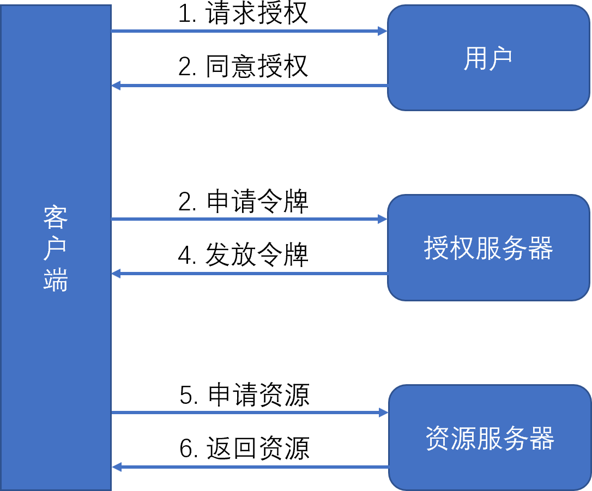
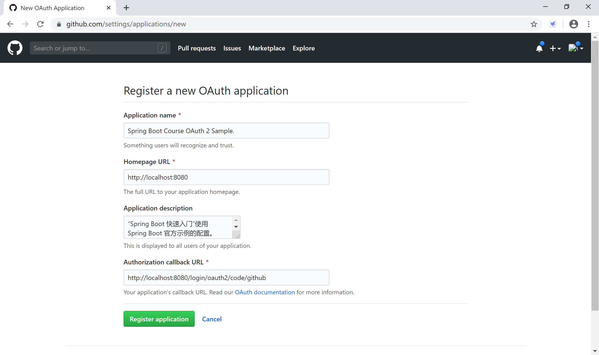
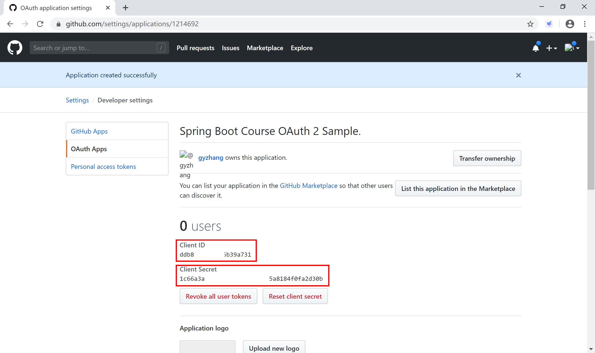
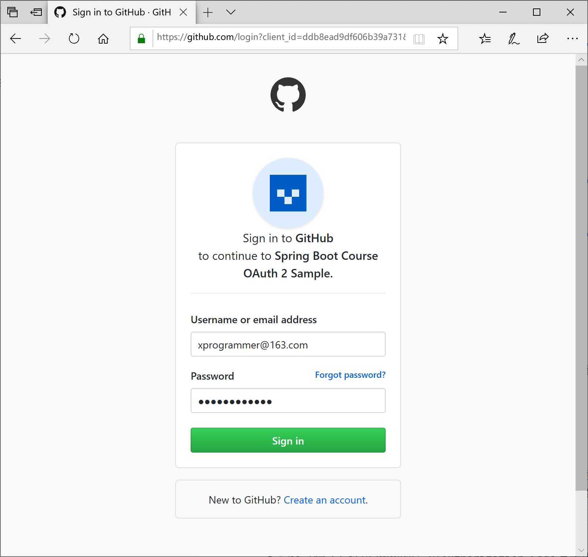
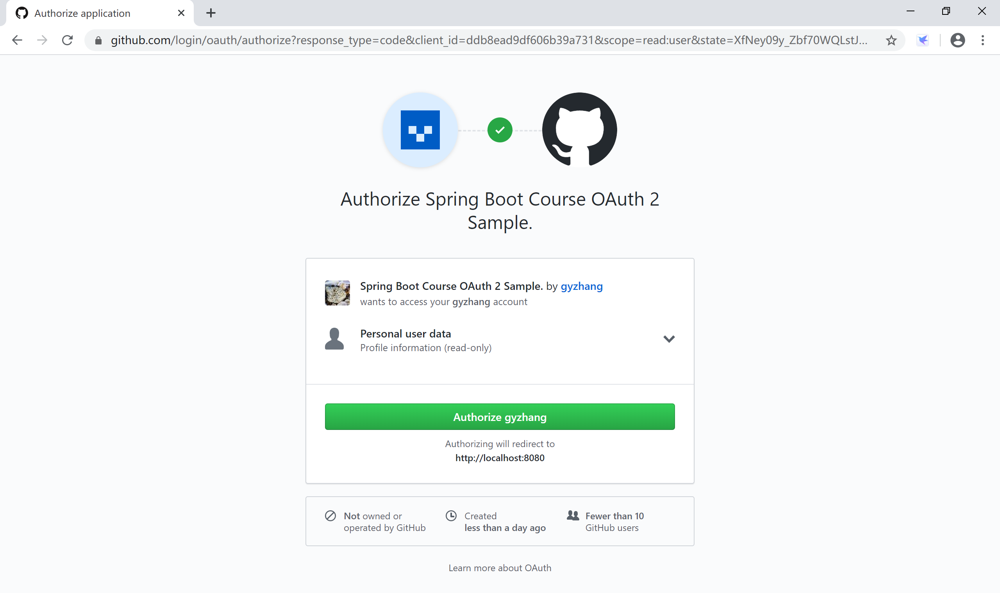
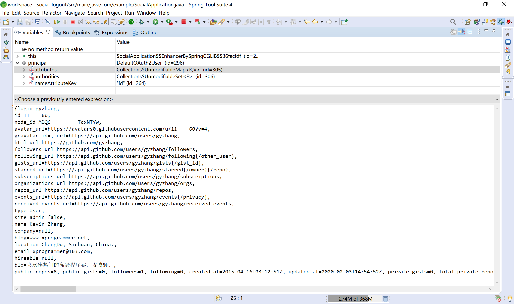
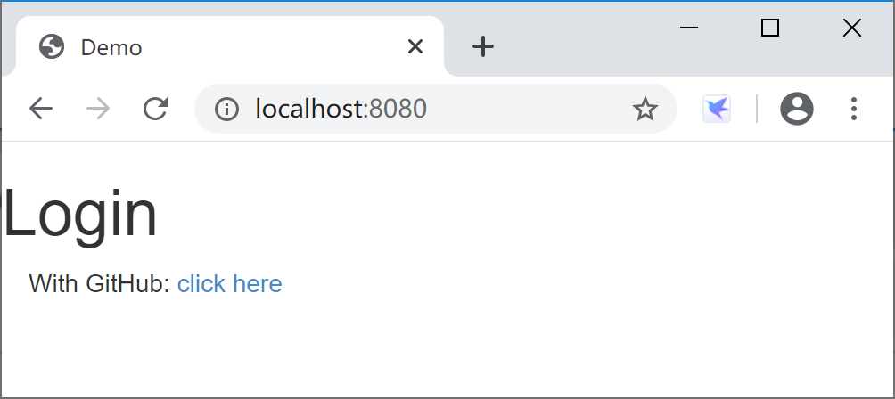
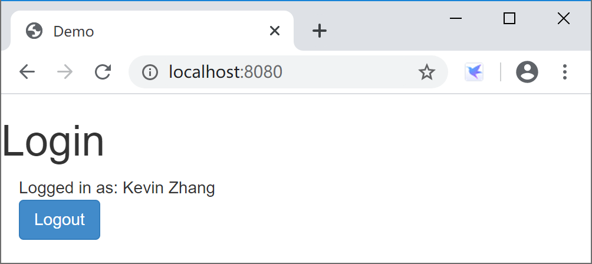
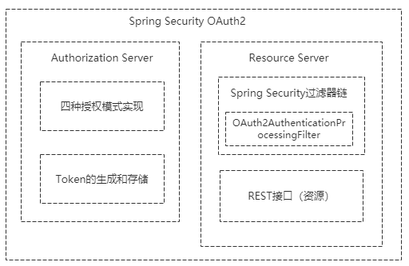

## 12.3 OAuth 2

OAuth （Open Authorization，开放授权）是一个关于授权的开放网络标准，它为用户资源的授权定义了一个安全、开放及简单的标准，允许用户让第三方应用访问该用户在某一网站上存储的私密的资源（如照片，视频，联系人列表），而不需要将用户名和密码提供给第三方应用。

OAuth 允许用户提供一个令牌，而不是用户名和密码来访问他们存放在特定服务提供者的数据。每一个令牌授权一个特定的网站在特定的时段内访问特定的资源。这样，OAuth 让用户可以授权第三方网站访问他们存储在另外服务提供者的某些特定信息，而非所有内容。

目前 OAuth 最新版本是 2.0，在全世界得到了广泛地应用，在国内主流的QQ，微信等第三方授权登录方式都是基于OAuth 2 实现的。

OAuth 2 在“客户端”与“服务提供商”之间，设置了一个授权层（authorization layer）。“客户端”不能直接登录“服务提供商”，只能登录授权层，以此将用户与客户端分离。“客户端”登录需要 OAuth 提供的令牌，否则将提示认证失败而导致客户端无法访问服务。

> 为了方便理解，可以想象 OAuth2.0 就是在用户资源和第三方应用之间的一个中间层（授权层 authorization layer），它把资源和第三方应用隔开，使得第三方应用无法直接访问资源，从而起到保护资源的作用。

本小节我们学习 Spring Boot 项目中是如何配置使用 OAuth 2 服务器端，并让 OAuth 2 整合 Spring Security 来保护我们的 REST 服务接口。

### 12.3.1 基本概念

[OAuth 2](https://tools.ietf.org/html/rfc6749) 标准中定义了以下几种角色：

- 资源所有者（Resource Owner）：代表授权客户端访问本身资源信息的用户（User），如微信用户其具有头像、照片、朋友圈等资源。
- 资源服务器（Resource Server）：资源服务器托管了受保护的用户账号信息，可以向第三方提供资源，如头像、照片、朋友圈等资源。
- 授权服务器（Authorization Server）：授权服务器用来验证用户身份然后为客户端派发资源访问令牌。资源服务器接受此令牌并验证您的身份。
- 客户端（Client）：代表意图访问受限资源的第三方应用。在访问实现之前，它必须先经过用户者授权，并且获得的授权凭证将进一步由授权服务器进行验证。

为了便于理解，现在假设有一个名叫“脸盆网”的社交网站，用户在首次登陆时会要求导入用户在facebook的好友列表，以便于快速建立社交关系。具体的授权流程如下：

1. 用户登陆脸盆网，脸盆网试图访问facebook上的好友列表；
2. 脸盆网发现该资源是facebook的受保护资源，于是返回302将用户重定向至facebook登陆页面；
3. 用户完成认证后，facebook提示用户是否将好友列表资源授权给脸盆网使用（如果本来就是已登陆facebook状态则直接显示是否授权的页面）；
4. 用户确认后，脸盆网通过`授权码模式`获取了facebook颁发的access_token；
5. 脸盆网携带该token访问facebook的获取用户接口`https://api.facebook.com/user`,facebook验证token无误后返回了与**该token绑定**的用户信息；
6. 脸盆网的 Spring Security 安全框架根据返回的用户信息构造出了 principal 对象并保存在session中；
7. 脸盆网再次携带该token访问好友列表，facebook根据**该token对应的用户**返回该用户的好友列表信息；
8. 该用户后续在脸盆网发起的访问facebook上的资源，只要在token有效期及权限范围内均可以正常获取（比如想访问一下保存在facebook里的相册）。

不难看出，这个假设的场景中，脸盆网就是第三方应用（客户端 Client），而facebook既充当了认证服务器，又充当了资源服务器，资源所有者就是用户（用户持有的资源，就是用户再facebook上的好友列表）。

OAuht 2 解决问题的关键在于使用**授权服务器**提供一个**访问凭据**给到**第三方应用**，让**第三方应用**可以在不知道资源所有者在资源服务器上的账号和密码的情况下，能获取到资源所有者在资源服务器上的受保护资源（这里的受保护资源就是**用户在facebook上的好友列表**）。



1. 客户端向用户（资源所有者）请求其授权；

2. 用户单击客户端所呈现的服务授权页面上的同意授权按钮后，客户端收到用户的授权许可，这个授权许可是一个代表资源所有者授权的凭据；

3. 客户端向授权服务器请求访问令牌，并出示授权许可；

4. 授权服务器对客户端身份进行认证，并校验授权许可，如果都是有效的，则发放访问令牌；

5. 客户端向资源服务器请求受保护的资源，并出示访问令牌；

6. 资源服务器校验访问令牌，如果令牌有效，则提供服务。

OAuth 2.0 提供了4种授权模式：

- 授权码 Authorization Code：是最常使用的一种授权许可类型，它适用于第三方应用类型为`server-side`型应用的场景。`Authorization Code`授权流程基于重定向跳转，客户端必须能够与`User-agent`（即用户的 Web 浏览器）交互并接收通过`User-agent`路由发送的实际`authorization code`值。适合普通服务器端应用使用；
- 简化（隐式）许可 Implicit：和`Authorization Code`基于重定向跳转的授权流程十分相似，但它适用于移动应用和 Web App，这些应用与普通服务器端应用相比有个特点，即`client secret`不能有效保存和信任；
- 资源所有者密码凭证 Resource Owner Password Credentials：适用于用户与客户端具有信任关系的情况，例如设备操作系统或同一组织的内部及外部应用。用户与应用交互表现形式往往体现为客户端能够直接获取用户凭据（用户名和密码，通常使用交互表单）；
- 客户端凭证 Client Credentials：是最简单的一种授权流程。客户端可以直接使用它的`client credentials`或其他有效认证信息向授权服务器发起获取`access token`的请求。

上面这4种授权模式，各有各的适用场景，我们在实际项目种需要根据项目类型选择使用。

1. 授权码模式：第三方Web服务器端应用与第三方原生App；
2. 简化模式：第三方单页面应用；
3. 密码模式：第一方单页应用与第一方原生App；
4. 客户端模式：没有用户参与的，完全信任的服务器端服务。


### 12.3.2 集成示例

Spring Boot 对 OAuth 2.0 提供了良好的集成，[官方文档](https://docs.spring.io/spring-boot/docs/current-SNAPSHOT/reference/htmlsingle/#boot-features-security-oauth2)提供了简要的说明，[官方示例](https://spring.io/guides/tutorials/spring-boot-oauth2/)提供了详细的指导。

#### 12.3.2.1 官方示例

下面我们以官方示例来介绍如何在 Spring Boot 中使用 OAuth 2。

到[https://github.com/spring-guides/tut-spring-boot-oauth2](https://github.com/spring-guides/tut-spring-boot-oauth2) clone 版本库到本地。

```
git clone https://github.com/spring-guides/tut-spring-boot-oauth2.git
```

这些示例在后端使用 Spring Boot 和 Spring Security 的单页应用程序，在前端使用 jQuery 和 bootstrap。

所有示例都是使用 Spring Boot 中的原生 OAuth 2.0 支持来实现的。

官方示例版本库里面包含的5个示例，后一个示例都比前一个示例添加了新功能。

- [**simple**](https://spring.io/guides/tutorials/spring-boot-oauth2/#_social_login_simple)：一个非常基本的静态应用程序，只有一个主页，通过 Spring Boot 的 OAuth 2.0 配置属性无条件登录（如果您访问主页，您将被自动重定向到GitHub）。
- [**click**](https://spring.io/guides/tutorials/spring-boot-oauth2/#_social_login_click)：添加用户必须单击才能登录的显式链接。
- [**logout**](https://spring.io/guides/tutorials/spring-boot-oauth2/#_social_login_logout)：为经过身份验证的用户添加注销链接。
- [**two-providers**](https://spring.io/guides/tutorials/spring-boot-oauth2/#_social_login_two_providers)：添加第二个登录提供程序，以便用户可以在主页上选择要使用哪一个。
- [**custom-error**](https://spring.io/guides/tutorials/spring-boot-oauth2/#_social_login_custom_error)：为未经身份验证的用户添加错误消息，并基于 GitHub 的 API 添加自定义身份验证。

##### 12.3.2.1.1 simple 示例项目

我们先用 simple 项目来讲解如何在 Spring Boot 应用来介绍如何将 github 作为一个认证服务器，完成单点登录（Single Sign On），然后再介绍 logout 示例项目。

在 github 上[注册](https://github.com/settings/developers)一个新的 OAuth 应用。

打开[https://github.com/settings/developers](https://github.com/settings/developers)，注册一个新的应用：


在 OAuth 新应用注册页面，填写对应的信息，需要注意两个地方：

- 主页URL：http://localhost:8080
- 认证回调URL：http://localhost:8080/login/oauth2/code/github

其他信息按照需要填写。



填写完成后，单击“Register application”按钮，完成注册后，github 生成两个ID：Client ID 和 Client Secret，保存这两个ID值，供后续在 Spring Boot 中配置 OAuth 认证用。



打开 simple 应用的 application.yml 配置文件，使用上面生成的两个 ID 值填充 client-id 和 client-secret 两个属性。

```yaml
spring:
  security:
    oauth2:
      client:
        registration:
          github:
            client-id: your-github-client-id
            client-secret: your-github-client-secret
```

启动应用，打开浏览器，输入[http://localhost:8080/](http://localhost:8080/)，如果你没有登录过 github 则会跳转到 github 的登录页。



如果你本机浏览器登录过 github 则直接授权当前 github 用户（下图中的用户就是 gyzhang）登录应用。



完成授权后，返回系统的首页。


主页 index.html 文件中引用了 jquery 和 bootstrap 脚本和样式。

```html
<!doctype html>
<html lang="en">
<head>
    <meta charset="utf-8"/>
    <meta http-equiv="X-UA-Compatible" content="IE=edge"/>
    <title>Demo</title>
    <meta name="description" content=""/>
    <meta name="viewport" content="width=device-width"/>
    <base href="/"/>
    <link rel="stylesheet" type="text/css" href="/webjars/bootstrap/css/bootstrap.min.css"/>
    <script type="text/javascript" src="/webjars/jquery/jquery.min.js"></script>
    <script type="text/javascript" src="/webjars/bootstrap/js/bootstrap.min.js"></script>
</head>
<body>
	<h1>Demo</h1>
	<div class="container"></div>
</body>
</html>
```

前端页面能够引用这些 js 和 css 是因为项目pom文件中的如下依赖：

```xml
<dependency>
    <groupId>org.webjars</groupId>
    <artifactId>jquery</artifactId>
    <version>2.1.1</version>
</dependency>
<dependency>
    <groupId>org.webjars</groupId>
    <artifactId>bootstrap</artifactId>
    <version>3.2.0</version>
</dependency>
<dependency>
    <groupId>org.webjars</groupId>
    <artifactId>webjars-locator-core</artifactId>
</dependency>
```

项目中几乎没有自己写的代码，是因为使用了`spring-boot-starter-oauth2-client`这个启动器依赖。

```xml
<dependency>
    <groupId>org.springframework.boot</groupId>
    <artifactId>spring-boot-starter-oauth2-client</artifactId>
</dependency>
```

这里，使用 Spring Boot 使用的是“[授权码](https://tools.ietf.org/html/rfc6749#section-4)”认证方式。

```
     +----------+
     | Resource |
     |   Owner  |
     |          |
     +----------+
          ^
          |
         (B)
     +----|-----+          Client Identifier      +---------------+
     |         -+----(A)-- & Redirection URI ---->|               |
     |  User-   |                                 | Authorization |
     |  Agent  -+----(B)-- User authenticates --->|     Server    |
     |          |                                 |               |
     |         -+----(C)-- Authorization Code ---<|               |
     +-|----|---+                                 +---------------+
       |    |                                         ^      v
      (A)  (C)                                        |      |
       |    |                                         |      |
       ^    v                                         |      |
     +---------+                                      |      |
     |         |>---(D)-- Authorization Code ---------'      |
     |  Client |          & Redirection URI                  |
     |         |                                             |
     |         |<---(E)----- Access Token -------------------'
     +---------+       (w/ Optional Refresh Token)
```

上面 simple 示例（运行中，如截图所示）中的4个 OAuth 2.0 角色如下：

1. 资源所有者（Resource Owner）：github 用户 gyzhang；
2. 资源服务器（Resource Server）：github；
3. 授权服务器（Authorization Server）：github；
4. 客户端（Client）：simple 项目。

> 虽然在 simple 项目中，并没有在页面上引用 github 的资源，但是下面的logout 项目会演示如何引用资源服务器上的用户资源。

##### 12.3.2.1.2 logout 示例项目

在 simple 的基础上，进一步增加了登录和注销链接和用户全名等信息的 logout 项目，更加清晰的描述了如何使用资源服务器的资源。

在 SocialApplication 启动类上添加 @RestController 注解，并提供 user 方法，向页面返回登录 github 用户的全名。

```java
@SpringBootApplication
@RestController
public class SocialApplication extends WebSecurityConfigurerAdapter {

	@RequestMapping("/user")
	public Map<String, Object> user(@AuthenticationPrincipal OAuth2User principal) {
		return Collections.singletonMap("name", principal.getAttribute("name"));
	}

	@Override
	protected void configure(HttpSecurity http) throws Exception {
		// @formatter:off
		http
			.authorizeRequests(a -> a
				.antMatchers("/", "/error", "/webjars/**").permitAll()
				.anyRequest().authenticated()
			)
			.exceptionHandling(e -> e
				.authenticationEntryPoint(new HttpStatusEntryPoint(HttpStatus.UNAUTHORIZED))
			)
			.csrf(c -> c
				.csrfTokenRepository(CookieCsrfTokenRepository.withHttpOnlyFalse())
			)
			.logout(l -> l
				.logoutSuccessUrl("/").permitAll()
			)
			.oauth2Login();
		// @formatter:on
	}

	public static void main(String[] args) {
		SpringApplication.run(SocialApplication.class, args);
	}

}
```

当然，上述方法中`OAuth2User principal`参数封装了用户（github 用户 gyzhang）在 github 上的资源，比如说用户的全名“Kevin Zhang”和自我介绍“喜欢凑热闹的高龄程序猿，攻城狮。”等信息，可供第三方应用客户端取用。下图是用 github 用户 gyzhang 登录后的信息：



启动类上的 configure 方法，提供了 Spring Security 相关配置。

页面 index.html 中添加了登录和注销的，并在登录后显示用户名称（Kevin Zhang，这就是资源服务器提供的用户资源）。

```html
<!doctype html>
<html lang="en">
<head>
<meta charset="utf-8" />
<meta http-equiv="X-UA-Compatible" content="IE=edge" />
<title>Demo</title>
<meta name="description" content="" />
<meta name="viewport" content="width=device-width" />
<base href="/" />
<link rel="stylesheet" type="text/css"
    href="/webjars/bootstrap/css/bootstrap.min.css" />
<script type="text/javascript" src="/webjars/jquery/jquery.min.js"></script>
<script type="text/javascript"
    src="/webjars/bootstrap/js/bootstrap.min.js"></script>
</head>
<body>
    <h1>Login</h1>
    <div class="container unauthenticated">
        With GitHub: <a href="/oauth2/authorization/github">click here</a>
    </div>
    <div class="container authenticated" style="display: none">
        Logged in as: <span id="user"></span>
        <div>
            <button onClick="logout()" class="btn btn-primary">Logout</button>
        </div>
    </div>
    <script type="text/javascript"
    src="/webjars/js-cookie/js.cookie.js"></script>
    <script type="text/javascript">
          $
              .ajaxSetup({
                beforeSend : function(xhr, settings) {
                  if (settings.type == 'POST' || settings.type == 'PUT'
                      || settings.type == 'DELETE') {
                    if (!(/^http:.*/.test(settings.url) || /^https:.*/
                        .test(settings.url))) {
                      // Only send the token to relative URLs i.e. locally.
                      xhr.setRequestHeader("X-XSRF-TOKEN",
                          Cookies.get('XSRF-TOKEN'));
                    }
                  }
                }
              });
          $.get("/user", function(data) {
            $("#user").html(data.name);
            $(".unauthenticated").hide();
            $(".authenticated").show();
          });
          var logout = function() {
            $.post("/logout", function() {
              $("#user").html('');
              $(".unauthenticated").show();
              $(".authenticated").hide();
            })
            return true;
          }
        </script>
</body>
</html>
```

运行应用，访问[http://localhost:8080/](http://localhost:8080/)，效果如下：



单击“click here”链接，通过 github 认证返回后的页面上使用用户的资源，显示用户名称（Kevin Zhang）。



> 本小节示例项目代码：
> 
> [https://github.com/spring-guides/tut-spring-boot-oauth2](https://github.com/spring-guides/tut-spring-boot-oauth2)

#### 12.3.2.2 用户名密码认证

在这一小节，我们学习如何自己搭建“授权服务器”来完成 OAuth 2 的认证。

Spring Security OAuth 2 主要包含认证服务器（@EnableAuthorizationServer）和资源服务器（ @EnableResourceServer）这两大块的实现：



认证服务器主要包含了四种授权模式的实现和 Token 的生成与存储，我们也可以在认证服务器中自定义获取 Token 的方式；资源服务器主要是在 Spring Security 的过滤器链上加了 OAuth2AuthenticationProcessingFilter 过滤器，即使用 OAuth 2 协议发放令牌认证的方式来保护我们的资源。

