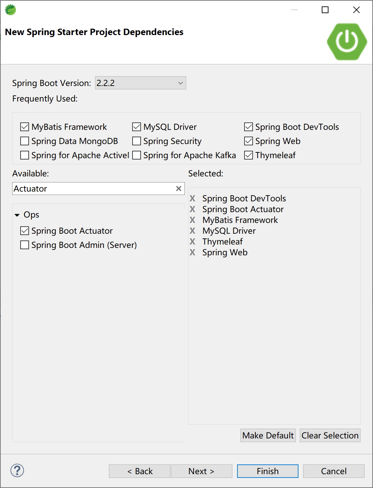
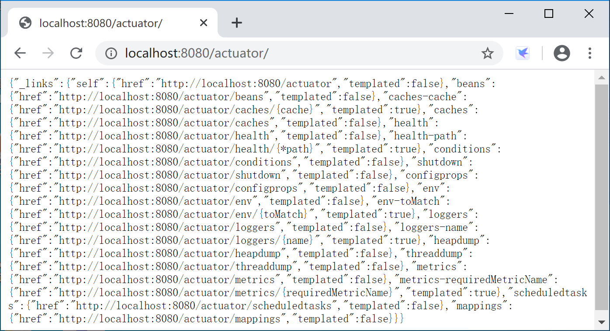
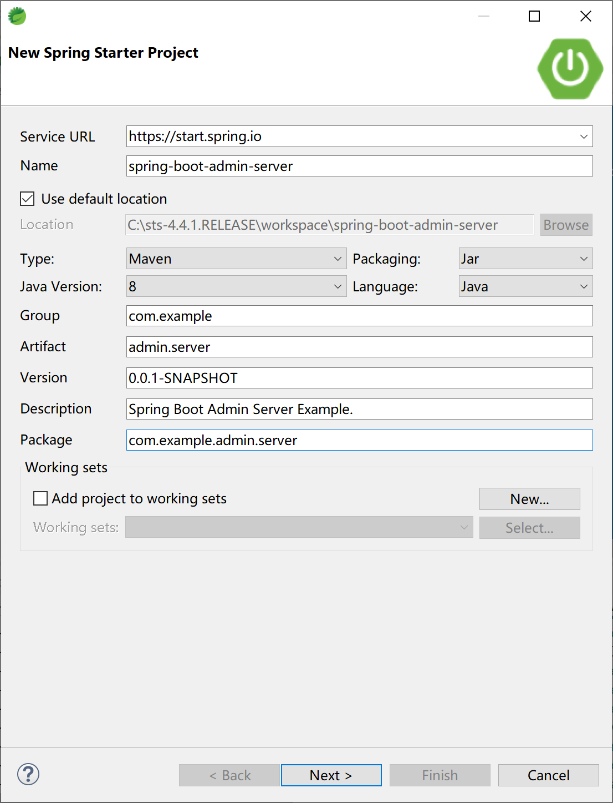
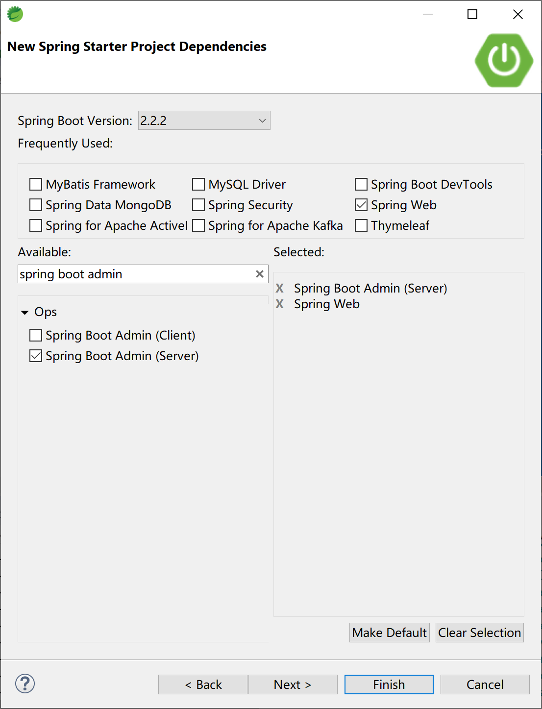
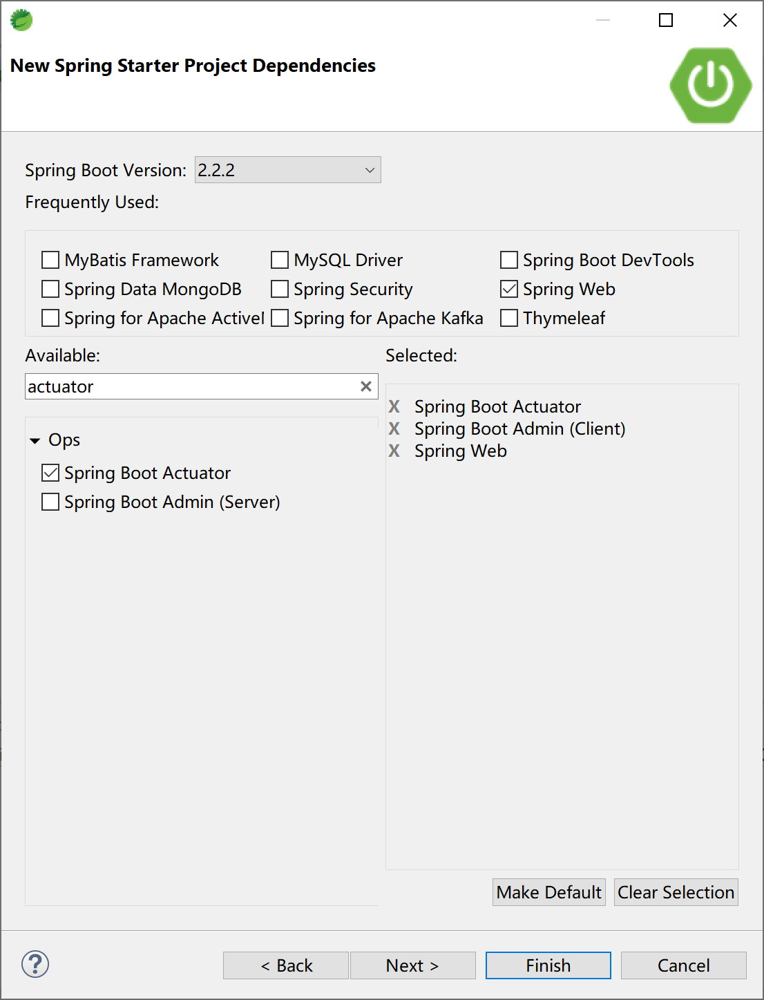
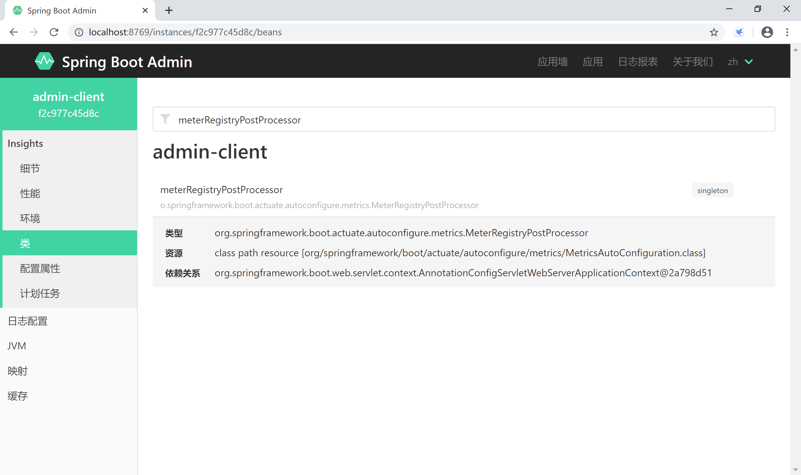

## 13.2 使用应用监控

Spring Boot应用在启用Actuator后，提供了非常原始的监控信息（json数据），当然我们也可以使用Spring Boot Admin来以一种直观的方式监控Spring Boot应用中的各种信息。

### 13.2.1 使用Actuator

创建新的Spring Boot应用，引入需要的启动器依赖，特别是`spring-boot-starter-actuator`。



在配置文件application.yml中，添加数据库连接及MyBatis配置信息。

```yaml
# mysql数据源配置
spring:
  datasource:
    url: jdbc:mysql://localhost:3306/ssdemo?useUnicode=true&characterEncoding=utf-8&serverTimezone=GMT%2B8
    username: root
    password: 123456
    driver-class-name: com.mysql.cj.jdbc.Driver
# mybatis 配置信息
mybatis:
  mapper-locations: classpath:mapping/*Mapper.xml
  type-aliases-package: com.example.actuator.entity
  configuration:
    map-underscore-to-camel-case: true
```

Spring Starter项目向导生成的项目pom依赖配置信息如下，最主要的启动器依赖是`spring-boot-starter-actuator`依赖配置项。

```xml
<dependency>
    <groupId>org.springframework.boot</groupId>
    <artifactId>spring-boot-starter-actuator</artifactId>
</dependency>
<dependency>
    <groupId>org.springframework.boot</groupId>
    <artifactId>spring-boot-starter-thymeleaf</artifactId>
</dependency>
<dependency>
    <groupId>org.springframework.boot</groupId>
    <artifactId>spring-boot-starter-web</artifactId>
</dependency>
<dependency>
    <groupId>org.mybatis.spring.boot</groupId>
    <artifactId>mybatis-spring-boot-starter</artifactId>
    <version>2.1.1</version>
</dependency>

<dependency>
    <groupId>org.springframework.boot</groupId>
    <artifactId>spring-boot-devtools</artifactId>
    <scope>runtime</scope>
    <optional>true</optional>
</dependency>
<dependency>
    <groupId>mysql</groupId>
    <artifactId>mysql-connector-java</artifactId>
    <scope>runtime</scope>
</dependency>
```

根据监控需要，在application.yml配置文件中打开除了info之外的所有（为了方便学习）监控端点。

```yaml
# Actuator 端口配置
management:
  endpoint:
    shutdown:
      enabled: true
  endpoints:
    web:
      exposure:
        include: "*"
        exclude:
        - info
```

启动应用后，访问[http://localhost:8080/actuator/](http://localhost:8080/actuator/)，查看监控端点信息。



在浏览器中进一步访问[http://localhost:8080/actuator/beans](http://localhost:8080/actuator/beans)端点，可以查看应用中注册的所有的bean。


> 本小节示例项目代码：
> 
> [https://github.com/gyzhang/SpringBootCourseCode/tree/master/spring-boot-actuator](https://github.com/gyzhang/SpringBootCourseCode/tree/master/spring-boot-actuator)

### 13.2.2 使用Spring Boot Admin

Spring Boot Admin是一个开源社区项目，用于管理和监控SpringBoot应用程序。 应用程序作为Spring Boot Admin Client向为Spring Boot Admin Server注册（通过HTTP）或使用SpringCloud注册中心（例如Eureka，Consul）发现。 UI是的AngularJs应用程序，展示Spring Boot Admin Client的Actuator端点上的一些监控。常见的功能或者监控如下：

- 显示健康状况
- 显示详细信息，例如
  - JVM和内存指标
  - micrometer.io指标
  - 数据源指标
  - 缓存指标
- 显示构建信息编号
- 关注并下载日志文件
- 查看jvm系统和环境属性
- 查看Spring Boot配置属性
- 支持Spring Cloud的postable / env-和/ refresh-endpoint
- 轻松的日志级管理
- 与JMX-beans交互
- 查看线程转储
- 查看http跟踪
- 查看auditevents
- 查看http-endpoints
- 查看计划任务
- 查看和删除活动会话（使用spring-session）
- 查看Flyway / Liquibase数据库迁移
- 下载heapdump
- 状态变更通知（通过电子邮件，Slack，Hipchat，......）
- 状态更改的事件日志（非持久性）

当前Spring Boot Admin最新版本为2.2.1版。

#### 13.2.2.1 创建服务器端

创建Spring Boot Admin监控服务器。



选择Spring Web和Spring Boot Admin Server启动依赖。



其pom依赖文件主要内容如下：

```xml
<dependency>
    <groupId>org.springframework.boot</groupId>
    <artifactId>spring-boot-starter-web</artifactId>
</dependency>
<dependency>
    <groupId>de.codecentric</groupId>
    <artifactId>spring-boot-admin-starter-server</artifactId>
</dependency>
```

在配置文件application.yml中设置应用名称和服务器端口。

```yaml
spring:
  application:
    name: admin-server
server:
  port: 8769
```

在启动类中添加@EnableAdminServer注解。

```java
package com.example.admin.server;

import org.springframework.boot.SpringApplication;
import org.springframework.boot.autoconfigure.SpringBootApplication;

import de.codecentric.boot.admin.server.config.EnableAdminServer;

@SpringBootApplication
@EnableAdminServer
public class SpringBootAdminServerApplication {

	public static void main(String[] args) {
		SpringApplication.run(SpringBootAdminServerApplication.class, args);
	}

}
```

> 本小节示例项目代码：
> 
> [https://github.com/gyzhang/SpringBootCourseCode/tree/master/spring-boot-admin-server](https://github.com/gyzhang/SpringBootCourseCode/tree/master/spring-boot-admin-server)

#### 13.2.2.2 创建客户端

创建被监控的客户端。


添加Actuator和Spring Boot Admin Client启动器依赖。



在application.yml配置文件中添加Actuator配置，打开所有的监控端点。并将监控客户端注册到监控服务器上。

```yaml
spring:
  application:
    name: admin-client
  boot:
    admin:
      client:
        url: http://localhost:8769
server:
  port: 8768

management:
  endpoints:
    web:
      exposure:
        include: '*'
  endpoint:
    health:
      show-details: ALWAYS
```

> 本小节示例项目代码：
> 
> [https://github.com/gyzhang/SpringBootCourseCode/tree/master/spring-boot-admin-client](https://github.com/gyzhang/SpringBootCourseCode/tree/master/spring-boot-admin-client)

#### 13.2.2.3 测试验证

依次启动server和client两个应用，打开浏览器，访问[http://localhost:8769/](http://localhost:8769/) Spring Boot Admin Server，可以看到监控了1个客户端。


可以通过Spring Boot Admin Server提供的界面，方便地查看client应用通过Actuator输出的监控数据，相比原生的监控（json）数据友好多了。

