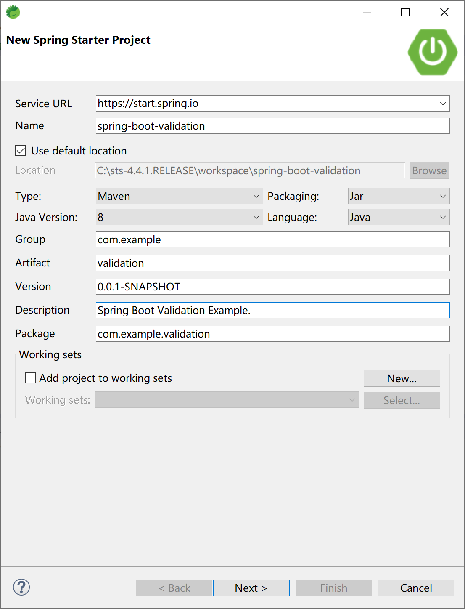
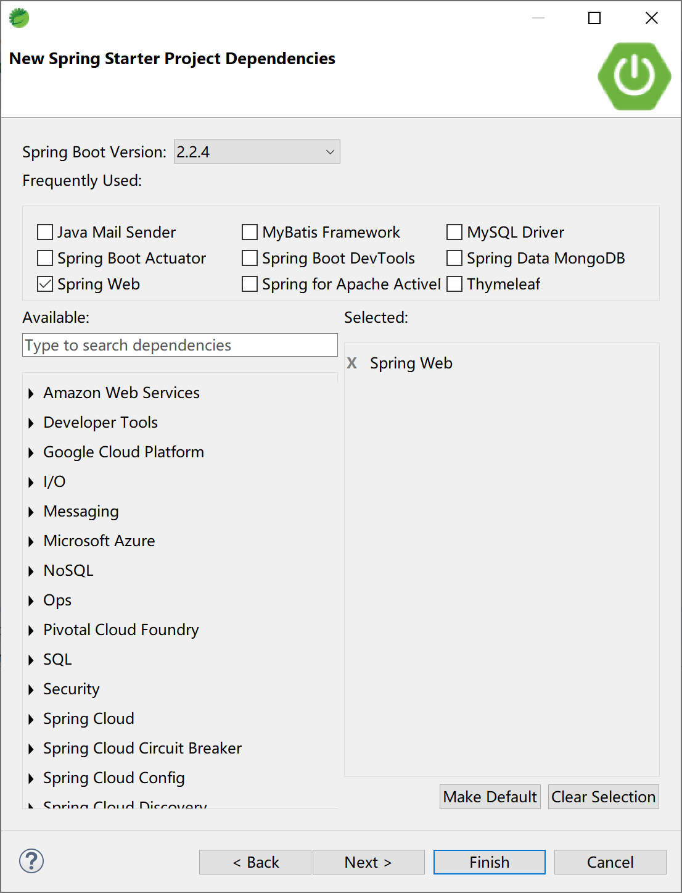
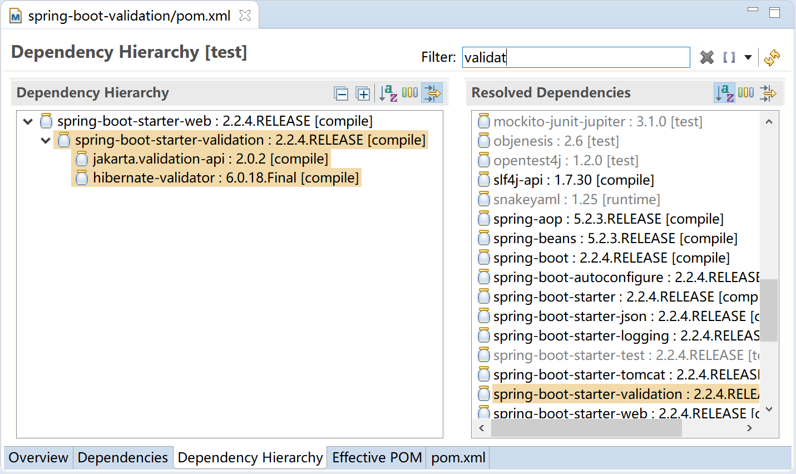

## 14.4 数据校验

在我们的日常工作中，对于任何一个应用而言，数据绝大多数情况下都会从客户端（前端，如浏览器）与服务端（后端，如tomcat）之间来回传输，如果只做客户端数据校验是远远不够的，是不安全的。我们必须在后台对数据进行验证，然后才将其持久化存储（如新增或更新到数据库）。

数据校验是一个企业级项目架构上最为基础的功能模块。

### 14.4.1 概念

[JSR-303 Bean Validation](https://jcp.org/en/jsr/detail?id=303) 是一个运行时的数据验证规范，为 JavaBean 验证定义了相应的元数据模型和 API。缺省的元数据是 Java Annotations，通过使用 XML 可以对原有的元数据信息进行覆盖和扩展。在应用程序中，通过使用 Bean Validation 或是你自己定义的 constraint，例如 `@NotNull`, `@Max`, `@ZipCode`， 就可以确保数据模型（JavaBean）的正确性。constraint 可以附加到字段，getter 方法，类或者接口上面。对于一些特定的需求，用户可以很容易的开发定制化的 constraint。Bean Validation 是一个运行时的数据验证框架，在验证之后验证的错误信息会被马上返回。

[Hibernate Validator](http://hibernate.org/validator/) 是 Bean Validation 的参考实现。 Hibernate Validator 提供了 JSR 303 规范中所有内置 constraint 的实现，除此之外还有一些附加的 constraint。

Spring's JSR-303规范，是标准JSR-303的一个变种。Spring Validation验证框架对参数的验证机制提供了@Validated，javax提供了@Valid（标准JSR-303规范），配合BindingResult可以直接提供参数验证结果。

常用的数据校验注解如下表：

| 限制                      | 说明                                                         |
| :------------------------ | :----------------------------------------------------------- |
| @Null                     | 限制只能为null                                               |
| @NotNull                  | 限制必须不为null                                             |
| @AssertFalse              | 限制必须为false                                              |
| @AssertTrue               | 限制必须为true                                               |
| @DecimalMax(value)        | 限制必须为一个不大于指定值的数字                             |
| @DecimalMin(value)        | 限制必须为一个不小于指定值的数字                             |
| @Digits(integer,fraction) | 限制必须为一个小数，且整数部分的位数不能超过integer，小数部分的位数不能超过fraction |
| @Future                   | 限制必须是一个将来的日期                                     |
| @Max(value)               | 限制必须为一个不大于指定值的数字                             |
| @Min(value)               | 限制必须为一个不小于指定值的数字                             |
| @Past                     | 限制必须是一个过去的日期                                     |
| @Pattern(value)           | 限制必须符合指定的正则表达式                                 |
| @Size(max,min)            | 限制字符长度必须在min到max之间                               |
| @Past                     | 验证注解的元素值（日期类型）比当前时间早                     |
| @NotEmpty                 | 验证注解的元素值不为null且不为空（字符串长度不为0、集合大小不为0） |
| @NotBlank                 | 验证注解的元素值不为空（不为null、去除首位空格后长度为0），不同于@NotEmpty，@NotBlank只应用于字符串且在比较时会去除字符串的空格 |
| @Email                    | 验证注解的元素值是Email，也可以通过正则表达式和flag指定自定义的email格式 |

### 14.4.2 集成

创建一个Spring Boot应用。

添加Spring Web启动器依赖。

在项目的pom中查看maven依赖，可以看到数据校验依赖（`spring-boot-starter-validation`）是直接包含在`spring-boot-starter-web`里面的，并且使用了`hibernate-validator`，所以我们在web应用中可以直接使用JSR-303规范的数据校验功能。

