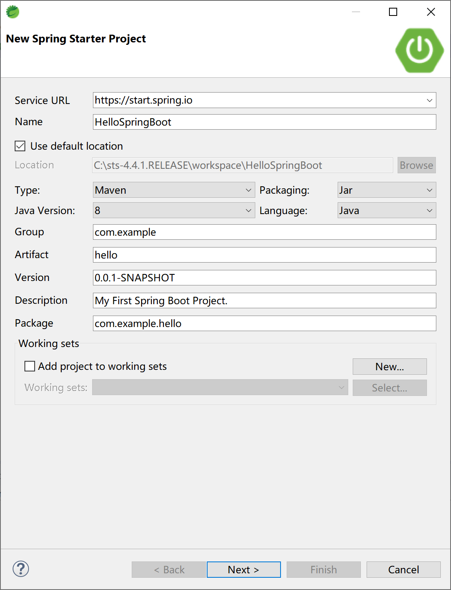
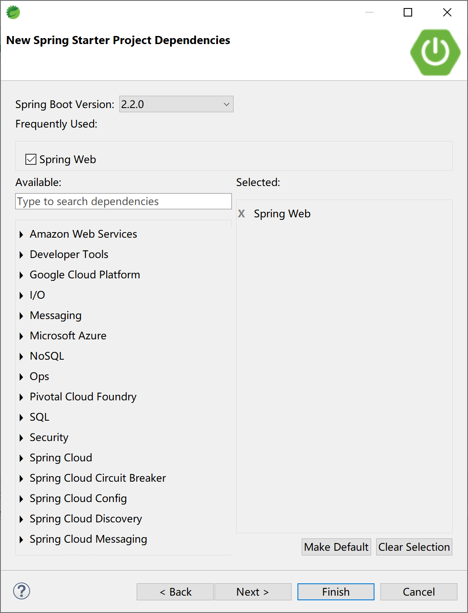
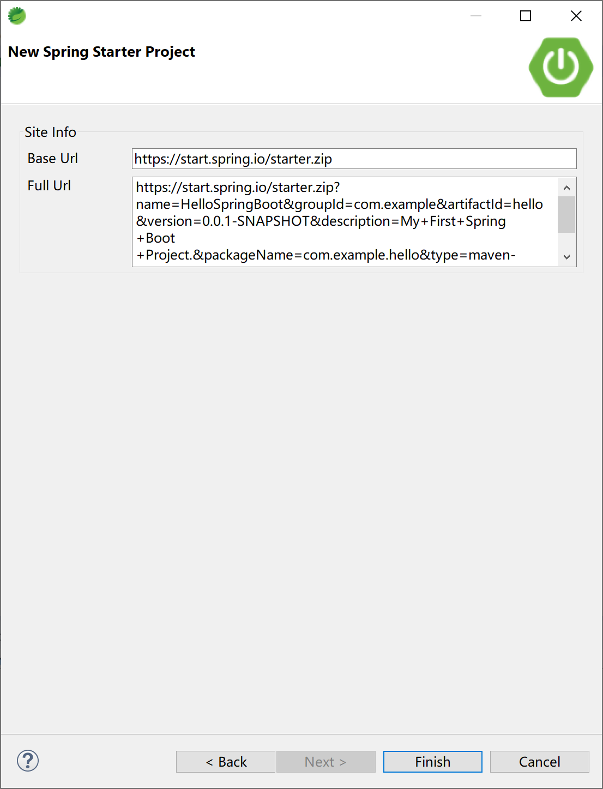
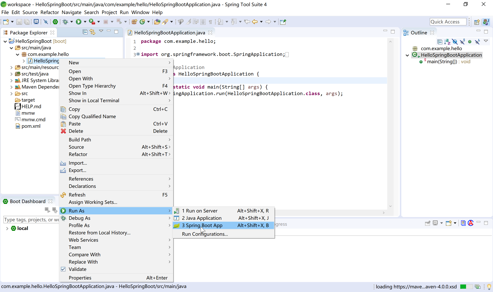
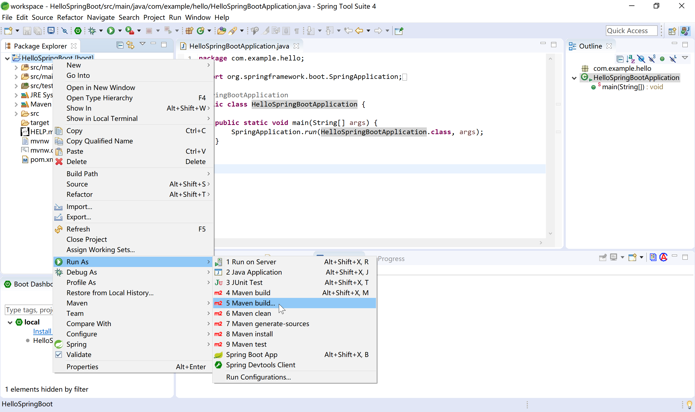
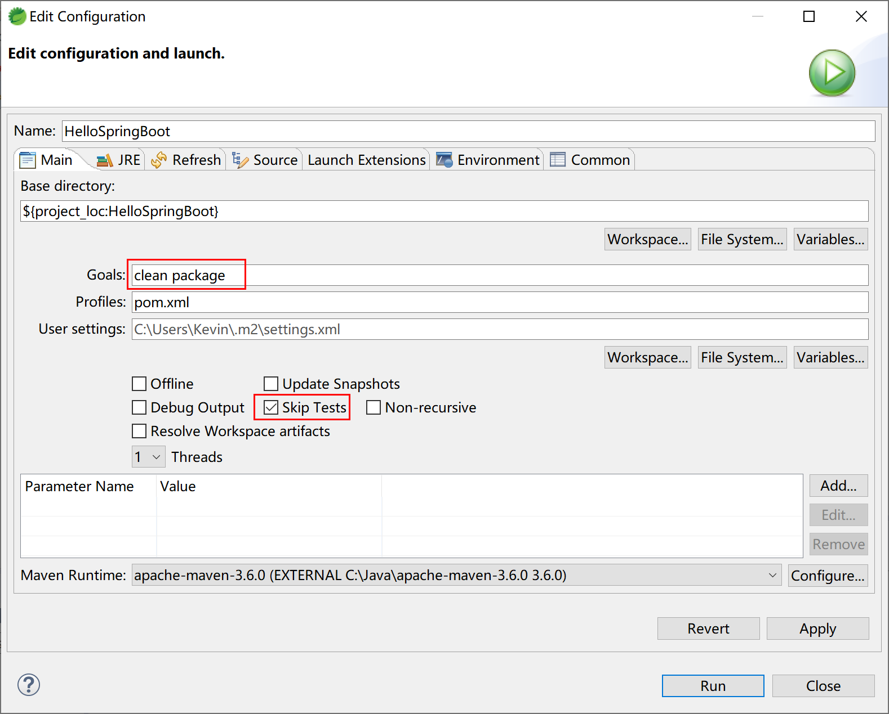
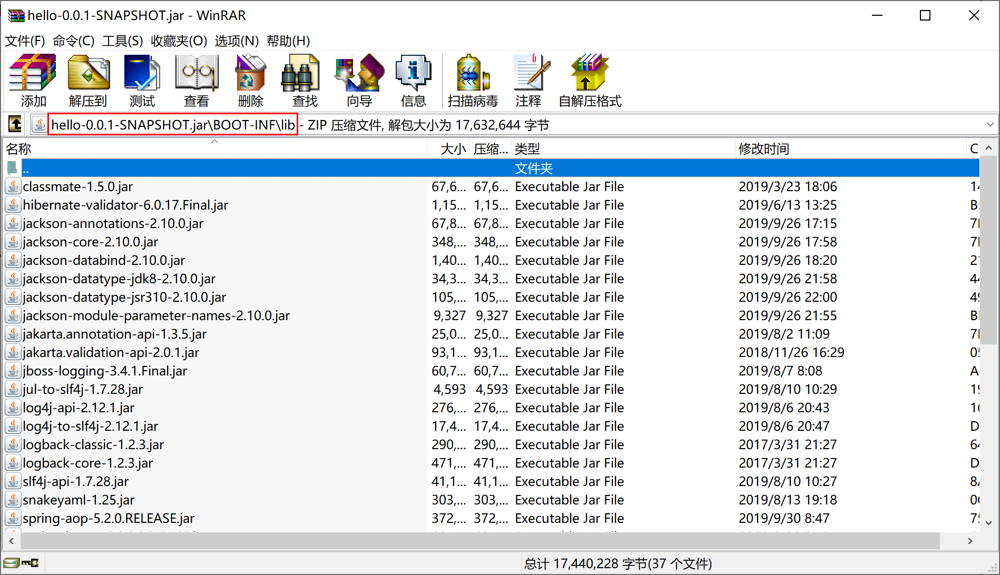
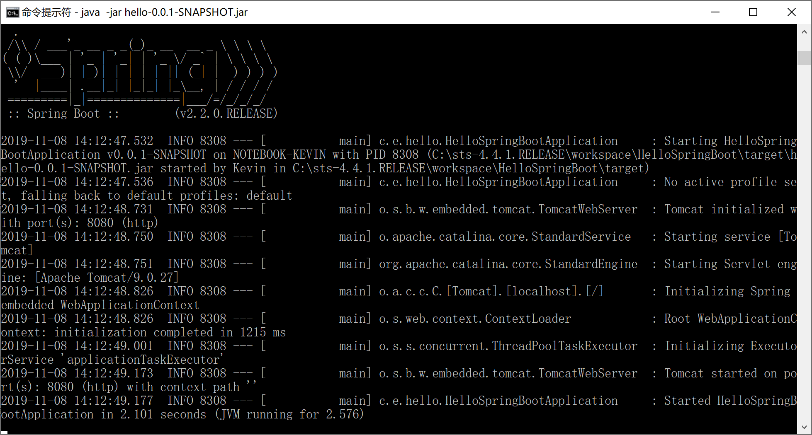

## 1.4 Hello Spring Boot

程序员都有“**Hello world.**”情结，我们在了解了Spring和Spring Boot的历史和特性之后，也以Spring Boot的“Hello world.”来感受我们后续将要学习的Spring Boot应用程序是如何开发的。

本小节的目的是为了给大家一个开发Spring Boot应用程序的初步印象，暂时没有开发环境，无法练习也没有关系，学习完第2章后返回来学习效果更好。

> 请参照本教程第2章的“开发环境配置”，完成本地开发环境的配置，然后再来“Hello Spring Boot.”。

### <span id = "createProject">1.4.1 创建项目</span>

首先，我们创建一个Spring Starter工程，如下图所示：


输入项目名称、项目的GAV（maven依赖的坐标：**G**roup、**A**rtifact、**V**ersion）、Package等信息：




选择Spring Boot的版本，当前最新为2.2.0（截至2019年11月）：




其实，STS开发工具，是通过Eclipse插件连接到网络，根据我们之前给定的参数设定请求参数，然后在Spring官网生成项目骨架（starter.zip），这和在 [start.spring.io](https://start.spring.io/) 上生成项目骨架是完全一致的。




参考 [start.spring.io](https://start.spring.io/) 生成项目骨架，后台服务一定是相同的。


稍等片刻（如果网络不给力，有可能要等上好一阵子呢），maven会下载所有的依赖。

Spring官网为我们生成的pom.xml文件如下：

```xml
<?xml version="1.0" encoding="UTF-8"?>
<project xmlns="http://maven.apache.org/POM/4.0.0" xmlns:xsi="http://www.w3.org/2001/XMLSchema-instance"
	xsi:schemaLocation="http://maven.apache.org/POM/4.0.0 https://maven.apache.org/xsd/maven-4.0.0.xsd">
	<modelVersion>4.0.0</modelVersion>
	<parent>
		<groupId>org.springframework.boot</groupId>
		<artifactId>spring-boot-starter-parent</artifactId>
		<version>2.2.0.RELEASE</version>
		<relativePath/> <!-- lookup parent from repository -->
	</parent>
	<groupId>com.example</groupId>
	<artifactId>hello</artifactId>
	<version>0.0.1-SNAPSHOT</version>
	<name>HelloSpringBoot</name>
	<description>My First Spring Boot Project.</description>

	<properties>
		<java.version>1.8</java.version>
	</properties>

	<dependencies>
		<dependency>
			<groupId>org.springframework.boot</groupId>
			<artifactId>spring-boot-starter-web</artifactId>
		</dependency>

		<dependency>
			<groupId>org.springframework.boot</groupId>
			<artifactId>spring-boot-starter-test</artifactId>
			<scope>test</scope>
			<exclusions>
				<exclusion>
					<groupId>org.junit.vintage</groupId>
					<artifactId>junit-vintage-engine</artifactId>
				</exclusion>
			</exclusions>
		</dependency>
	</dependencies>

	<build>
		<plugins>
			<plugin>
				<groupId>org.springframework.boot</groupId>
				<artifactId>spring-boot-maven-plugin</artifactId>
			</plugin>
		</plugins>
	</build>

</project>
```

需要注意的有几点：

- 第6-9行的spring-boot-starter-parent；
- 第22-25行的spring-boot-starter-web；
- 第42-45行的spring-boot-maven-plugin；

这些依赖，为我们大大简化了Spring应用程序的配置。当然，其中也隐藏了大量的魔法，在第3章中我们会简要的介绍这些魔法是怎么实现的，在这里，大家不要过度关注，不理解也不影响我们Say Hello to Spring Boot.

我们再来关注启动入口类`HelloSpringBootApplication`，这将是我们进入Spring Boot世界的第一道门。

```java
package com.example.hello;

import org.springframework.boot.SpringApplication;
import org.springframework.boot.autoconfigure.SpringBootApplication;

@SpringBootApplication
public class HelloSpringBootApplication {

	public static void main(String[] args) {
		SpringApplication.run(HelloSpringBootApplication.class, args);
	}

}
```

这里唯一陌生的，也是最需要关注的，当然就是`@SpringBootApplication`这个注解。它标识了这个类是个Spring Boot的应用程序。

这个类中有main方法，运行它看看效果：



虽然没有啥效果，但控制台打出的日志，表明，这个Spring Boot程序确实可以正确运行。

```

  .   ____          _            __ _ _
 /\\ / ___'_ __ _ _(_)_ __  __ _ \ \ \ \
( ( )\___ | '_ | '_| | '_ \/ _` | \ \ \ \
 \\/  ___)| |_)| | | | | || (_| |  ) ) ) )
  '  |____| .__|_| |_|_| |_\__, | / / / /
 =========|_|==============|___/=/_/_/_/
 :: Spring Boot ::        (v2.2.0.RELEASE)

2019-11-06 22:27:52.949  INFO 1704 --- [           main] c.e.hello.HelloSpringBootApplication     : Starting HelloSpringBootApplication on NOTEBOOK-KEVIN with PID 1704 (C:\sts-4.4.1.RELEASE\workspace\HelloSpringBoot\target\classes started by Kevin in C:\sts-4.4.1.RELEASE\workspace\HelloSpringBoot)
2019-11-06 22:27:52.952  INFO 1704 --- [           main] c.e.hello.HelloSpringBootApplication     : No active profile set, falling back to default profiles: default
2019-11-06 22:27:53.663  INFO 1704 --- [           main] o.s.b.w.embedded.tomcat.TomcatWebServer  : Tomcat initialized with port(s): 8080 (http)
2019-11-06 22:27:53.671  INFO 1704 --- [           main] o.apache.catalina.core.StandardService   : Starting service [Tomcat]
2019-11-06 22:27:53.672  INFO 1704 --- [           main] org.apache.catalina.core.StandardEngine  : Starting Servlet engine: [Apache Tomcat/9.0.27]
2019-11-06 22:27:53.727  INFO 1704 --- [           main] o.a.c.c.C.[Tomcat].[localhost].[/]       : Initializing Spring embedded WebApplicationContext
2019-11-06 22:27:53.728  INFO 1704 --- [           main] o.s.web.context.ContextLoader            : Root WebApplicationContext: initialization completed in 736 ms
2019-11-06 22:27:53.861  INFO 1704 --- [           main] o.s.s.concurrent.ThreadPoolTaskExecutor  : Initializing ExecutorService 'applicationTaskExecutor'
2019-11-06 22:27:54.019  INFO 1704 --- [           main] o.s.b.w.embedded.tomcat.TomcatWebServer  : Tomcat started on port(s): 8080 (http) with context path ''
2019-11-06 22:27:54.021  INFO 1704 --- [           main] c.e.hello.HelloSpringBootApplication     : Started HelloSpringBootApplication in 1.422 seconds (JVM running for 2.316)
```

### <span id = "controller">1.4.2 编写Controller代码</span>

下面，我们为这个程序添加一个Controller，输出“Hello Spring Boot.”这句话。

首先创建`com.example.hello.controller`包，然后在其下创建`SayHelloController`类，代码如下：

```java
package com.example.hello.controller;

import org.springframework.web.bind.annotation.RequestMapping;
import org.springframework.web.bind.annotation.RestController;

@RestController
public class SayHelloController {
	
	@RequestMapping("/hello")
	public String sayHello() {
		return "Hello Spring Boot.";
	}

}
```

### <span id = "runIDE">1.4.3 在IDE中运行</span>

再次运行`HelloSpringBootApplication`这个类（当然，也可以说运行这个Spring Boot应用/程序），在控制台中输出的日志，已经包含`DispatcherServlet`这个Spring MVC的前端分发器类了。

```

  .   ____          _            __ _ _
 /\\ / ___'_ __ _ _(_)_ __  __ _ \ \ \ \
( ( )\___ | '_ | '_| | '_ \/ _` | \ \ \ \
 \\/  ___)| |_)| | | | | || (_| |  ) ) ) )
  '  |____| .__|_| |_|_| |_\__, | / / / /
 =========|_|==============|___/=/_/_/_/
 :: Spring Boot ::        (v2.2.0.RELEASE)

2019-11-06 22:33:48.882  INFO 7872 --- [           main] c.e.hello.HelloSpringBootApplication     : Starting HelloSpringBootApplication on NOTEBOOK-KEVIN with PID 7872 (C:\sts-4.4.1.RELEASE\workspace\HelloSpringBoot\target\classes started by Kevin in C:\sts-4.4.1.RELEASE\workspace\HelloSpringBoot)
2019-11-06 22:33:48.891  INFO 7872 --- [           main] c.e.hello.HelloSpringBootApplication     : No active profile set, falling back to default profiles: default
2019-11-06 22:33:49.558  INFO 7872 --- [           main] o.s.b.w.embedded.tomcat.TomcatWebServer  : Tomcat initialized with port(s): 8080 (http)
2019-11-06 22:33:49.564  INFO 7872 --- [           main] o.apache.catalina.core.StandardService   : Starting service [Tomcat]
2019-11-06 22:33:49.565  INFO 7872 --- [           main] org.apache.catalina.core.StandardEngine  : Starting Servlet engine: [Apache Tomcat/9.0.27]
2019-11-06 22:33:49.613  INFO 7872 --- [           main] o.a.c.c.C.[Tomcat].[localhost].[/]       : Initializing Spring embedded WebApplicationContext
2019-11-06 22:33:49.614  INFO 7872 --- [           main] o.s.web.context.ContextLoader            : Root WebApplicationContext: initialization completed in 688 ms
2019-11-06 22:33:49.731  INFO 7872 --- [           main] o.s.s.concurrent.ThreadPoolTaskExecutor  : Initializing ExecutorService 'applicationTaskExecutor'
2019-11-06 22:33:49.863  INFO 7872 --- [           main] o.s.b.w.embedded.tomcat.TomcatWebServer  : Tomcat started on port(s): 8080 (http) with context path ''
2019-11-06 22:33:49.865  INFO 7872 --- [           main] c.e.hello.HelloSpringBootApplication     : Started HelloSpringBootApplication in 1.262 seconds (JVM running for 1.873)
2019-11-06 22:33:59.678  INFO 7872 --- [nio-8080-exec-1] o.a.c.c.C.[Tomcat].[localhost].[/]       : Initializing Spring DispatcherServlet 'dispatcherServlet'
2019-11-06 22:33:59.678  INFO 7872 --- [nio-8080-exec-1] o.s.web.servlet.DispatcherServlet        : Initializing Servlet 'dispatcherServlet'
2019-11-06 22:33:59.686  INFO 7872 --- [nio-8080-exec-1] o.s.web.servlet.DispatcherServlet        : Completed initialization in 8 ms
```

打开浏览器，访问[localhost:8080/hello](http://localhost:8080/hello)，可以正确得到前面Controller类中sayHello方法的输出：


恭喜你，你已经完成了你的第一个Spring Boot程序。

### <span id = "package">1.4.4 打包</span>

当一个应用开发完成后，需要分发时，通常会将Spring Boot应用程序打包为一个jar包。

在STS中，选择`Maven build...`



在Maven build的目标（Goals）中输入`clean package `，为了更快的打包，勾选`Skip Tests`复选框。



正常情况下，稍等片刻，Maven就会完成打包操作，注意观察控制台输出的日志。

`[INFO] BUILD SUCCESS`表示Maven任务正确完成。

```
[INFO] Scanning for projects...
[INFO] 
[INFO] -------------------------< com.example:hello >--------------------------
[INFO] Building HelloSpringBoot 0.0.1-SNAPSHOT
[INFO] --------------------------------[ jar ]---------------------------------
[INFO] 
[INFO] --- maven-clean-plugin:3.1.0:clean (default-clean) @ hello ---
[INFO] Deleting C:\sts-4.4.1.RELEASE\workspace\HelloSpringBoot\target
[INFO] 
[INFO] --- maven-resources-plugin:3.1.0:resources (default-resources) @ hello ---
[INFO] Using 'UTF-8' encoding to copy filtered resources.
[INFO] Copying 1 resource
[INFO] Copying 0 resource
[INFO] 
[INFO] --- maven-compiler-plugin:3.8.1:compile (default-compile) @ hello ---
[INFO] Changes detected - recompiling the module!
[INFO] Compiling 2 source files to C:\sts-4.4.1.RELEASE\workspace\HelloSpringBoot\target\classes
[INFO] 
[INFO] --- maven-resources-plugin:3.1.0:testResources (default-testResources) @ hello ---
[INFO] Not copying test resources
[INFO] 
[INFO] --- maven-compiler-plugin:3.8.1:testCompile (default-testCompile) @ hello ---
[INFO] Not compiling test sources
[INFO] 
[INFO] --- maven-surefire-plugin:2.22.2:test (default-test) @ hello ---
[INFO] Tests are skipped.
[INFO] 
[INFO] --- maven-jar-plugin:3.1.2:jar (default-jar) @ hello ---
[INFO] Building jar: C:\sts-4.4.1.RELEASE\workspace\HelloSpringBoot\target\hello-0.0.1-SNAPSHOT.jar
[INFO] 
[INFO] --- spring-boot-maven-plugin:2.2.0.RELEASE:repackage (repackage) @ hello ---
[INFO] Replacing main artifact with repackaged archive
[INFO] ------------------------------------------------------------------------
[INFO] BUILD SUCCESS
[INFO] ------------------------------------------------------------------------
[INFO] Total time:  3.251 s
[INFO] Finished at: 2019-11-08T11:29:53+08:00
[INFO] ------------------------------------------------------------------------
[WARNING] The requested profile "pom.xml" could not be activated because it does not exist.
```

打开项目文件目录下的target子目录，其中`hello-0.0.1-SNAPSHOT.jar`就是打包好的项目可运行jar包。


> 其中还有一个很小的`hello-0.0.1-SNAPSHOT.jar.original`文件，就是项目编译的文件。
>
> 而`hello-0.0.1-SNAPSHOT.jar`是spring-boot-maven-plugin插件帮我们把依赖jar包和内嵌tomcat打包到一起了的`fat jar`。

打开`hello-0.0.1-SNAPSHOT.jar`这个`fat jar`文件，查看其`BOOT-INF\lib`目录，可以看到其依赖的各种jar包。



### <span id = "run">1.4.5 独立运行程序</span>

Spring Boot打包出来的jar文件支持独立运行，执行`java -jar`，运行Hello Spring Boot程序。

```
java -jar hello-0.0.1-SNAPSHOT.jar
```

在命令提示符窗口中，可以看到这个Spring Boot程序正确启动了。



打开浏览器，访问[localhost:8080/hello](http://localhost:8080/hello)，同样可以正确得到前面Controller类中sayHello方法的输出。


后续，我们会一步一步地介绍在实际工作中，如何使用Spring Boot集成我们常用的开发框架/类库。
