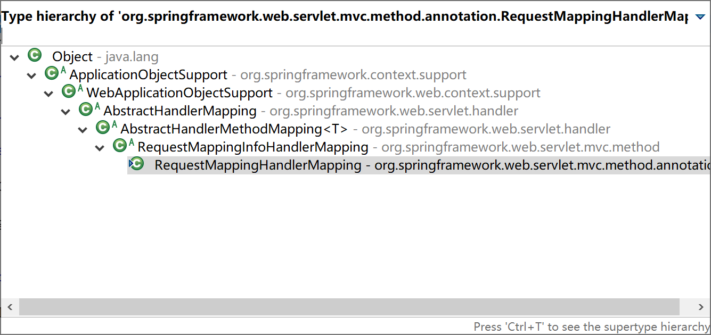
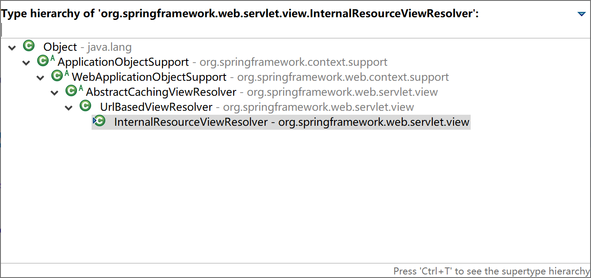
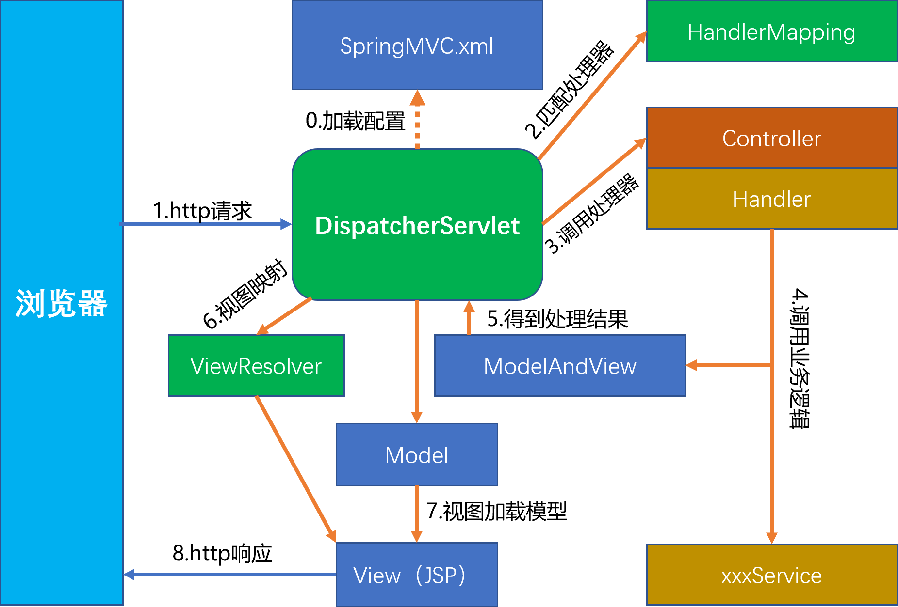
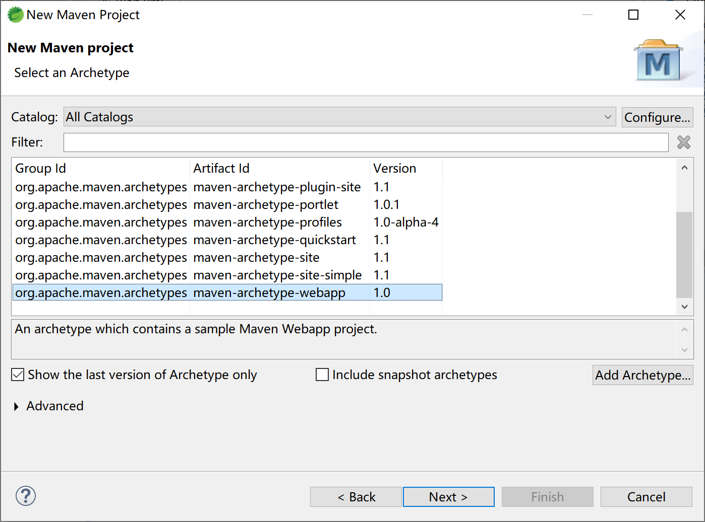
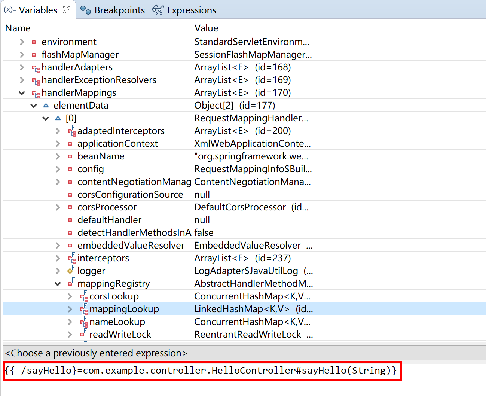
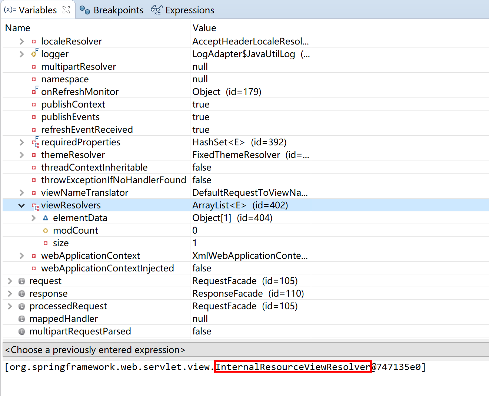
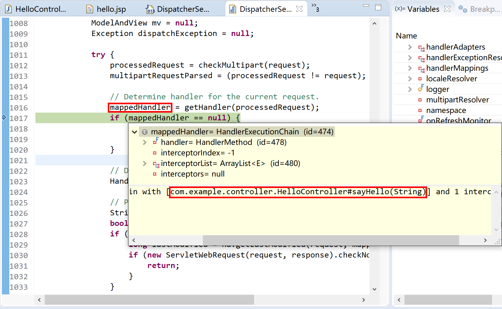

## 4.1 Spring MVC介绍

以前，我们大量的使用JSP+Servlet技术开发web应用。通过使用jstl技术（ Java server pages standarded tag library，即JSP标准标签库）封装一些常用组件，简化前端jsp页面的开发。

> 那个时候时间过得很慢，
>
> 慢到只能用一种技术规范，
>
> 开发web应用一辈子。 

现在，我们更多的是使用前后端分离的MVVM技术来构建web应用。例如前端使用vue，后端使用rest方式（Representational State Transfer）开发业务功能接口，供前端通过ajax方式调用。

> MVVM：Model-View-ViewModel的简写，它本质上就是MVC 的改进版。

无论是在以前还是现在，使用Spring开发web应用，首选的都是Spring MVC开发框架。

Spring MVC并不知道前端使用的视图技术，所以不会强迫您只使用 JSP 技术。实际上在Spring Boot 2.0框架中，Spring MVC推荐使用Thymeleaf模板技术。

Spring MVC分离了控制器、模型对象、分派器以及处理程序对象的角色，这种分离让它们更容易进行定制。

Spring 的 Web MVC 框架是围绕 `DispatcherServlet` 前端分发器设计的，它把请求分派给处理程序，同时带有可配置的处理程序映射、视图解析、本地语言（国际化，多语言支持）、主题解析以及上载文件等支持。默认的处理程序是非常简单的 `Controller` 接口，只有一个方法 `ModelAndView handleRequest(request, response)`。Spring 提供了一个控制器层次结构，可以派生子类。如果应用程序需要处理用户输入表单，那么可以继承 `AbstractFormController`。如果需要把多页输入处理到一个表单，那么可以继承 `AbstractWizardFormController`。

### 4.1.1 常用注解

Spring MVC在发展过程中也经历了一段“黑暗”时间：非常繁杂的xml配置，简直就是“xml hell”（xml配置地狱，指繁杂到失控的xml配置信息）。后来，使用上注解以后，才简洁易用起来。

所以，要想了解会用Spring MVC就必须掌握其最常用的注解。

#### 4.1.1.1 @Controller

在SpringMVC 中，控制器Controller 负责处理由前端分发器DispatcherServlet 分发的请求，它把用户请求的数据经过业务处理层处理之后封装成一个Model ，然后再把该Model 返回给对应的View 进行展示。

在Spring MVC中定义一个Controller不需要继承某个父类，也无需实现某个接口。你只需要使用@Controller 标记一个类是Controller即可。  

前端分发器DispatcherServlet将会扫描使用了该注解的类的方法，并检测该方法是否使用了@RequestMapping 注解。@Controller 只是定义了一个**控制器类**，而使用@RequestMapping 注解的方法才是真正处理请求的**处理器**。单单使用@Controller 标记在一个类上还不能真正意义上的说它就是Spring MVC 的一个控制器类，因为这个时候Spring 还不认识它。那么要如何做Spring 才能认识它呢？这个时候就需要我们把这个控制器类交给Spring 来管理。

各位，是否还记得Spring Boot启动类的注解`@SpringBootApplication`，这个注解是个复合注解，其中包含`@ComponentScan`会扫描到启动类包及其子包下的Controller控制器类，并将其加载到Spring容器中。

```java
@ComponentScan(excludeFilters = { @Filter(type = FilterType.CUSTOM, classes = TypeExcludeFilter.class),
		@Filter(type = FilterType.CUSTOM, classes = AutoConfigurationExcludeFilter.class) })
public @interface SpringBootApplication {
	...
}
```

#### 4.1.1.2 @RequestMapping

RequestMapping是一个用来处理请求地址映射的注解，可用于类或方法上。用于类上，表示类中的所有响应请求的方法都是以该地址作为父路径。 

RequestMapping注解有六个属性，下面我们把她分成三类进行说明（下面有相应示例）。

1. value， method：

- value：   指定请求的实际地址，指定的地址可以是URI Template 模式（后面将会说明）；

- method： 指定请求的method类型， GET、POST、PUT、DELETE等；

2. consumes，produces：

- consumes：指定处理请求的提交内容类型（Content-Type），例如application/json, text/html;

- produces:  指定返回的内容类型，仅当request请求头中的(Accept)类型中包含该指定类型才返回；

3. params，headers：

- params： 指定request中必须包含某些参数值是，才让该方法处理。

- headers： 指定request中必须包含某些指定的header值，才能让该方法处理请求。

##### 4.1.1.2.1 @PathVariables

用于将请求URL中的模板变量映射到功能处理方法的参数上，即取出uri模板中的变量作为参数。 

```java
@Controller  
public class TestController {  

     @RequestMapping(value="/product/{productId}",method = RequestMethod.GET)  
     public String getProduct(@PathVariable("productId") String productId){  
           System.out.println("Product Id : " + productId);  
           return "hello";  
     }  
    
     @RequestMapping(value="/javabeat/{regexp1:[a-z-]+}", method = RequestMethod.GET) 
     public String getRegExp(@PathVariable("regexp1") String regexp1){  
           System.out.println("URI Part 1 : " + regexp1);  
           return "hello";  
     }  
}
```

##### 4.1.1.2.2 @RequstParams

用于在Spring MVC后台控制层获取参数，类似一种是request.getParameter("name")，它有三个常用参数：defaultValue = "0", required = false, value = "isApp"；defaultValue 表示设置默认值，required通过boolean值设置是否是必须要传入的参数，value 值表示接受的传入的参数类型。

多数情况下`@RequestParam`可以省略。

```java
    @RequestMapping("genUsers")
    public String genUsers(@RequestParam int count) {
    //public String genUsers(int count) {
    	for (int i=2; i<count+2; i++) {
    		String str = UUID.randomUUID().toString().substring(16);
    		User user = new User();
    		user.setId(i);
    		user.setUserName(str);
    		user.setRealName(str);
    		user.setPassWord(str);
    		
    		userService.saveUser(user);
    	}
    	return "生成了" + count + "个用户。";
    }
```

#### 4.1.1.3 @ResponseBody 

该注解用于将Controller的方法返回的对象，通过适当的HttpMessageConverter转换为指定格式后，写入到Response对象的body数据区。 

> 返回的数据不是html页面，而是其他某种格式的数据时（如json、xml等）使用。

#### 4.1.1.4 @ModelAndView

用来存储处理完后的结果数据，以及显示该数据的视图。从名字上看ModelAndView中的Model代表模型，View代表视图，这个名字就很好地解释了该类的作用。业务处理器调用模型层处理完用户请求后，把结果数据存储在该类的model属性中，把要返回的视图信息存储在该类的view属性中，然后让该ModelAndView返回该Spring MVC框架。框架通过调用配置文件中定义的视图解析器，对该对象进行解析，最后把结果数据显示在指定的页面上。  

```java
    public ModelAndView handleRequestInternal(HttpServletRequest request,  
        HttpServletResponse response)throws Exception{  
        ...  
        Map<String,Object> model = new HashMap<String,Object>();  
        if(courtName != null){  
            model.put("courtName",courtName);  
            model.put("reservations",reservationService.query(courtName));  
        }  
        return new ModelAndView("reservationQuery",model);  
    }  
```

#### 4.1.1.5 @RestController

@RestController是一个复合注解，其作用等同于@Controller + @ResponseBody。 

```java
@Target(ElementType.TYPE)
@Retention(RetentionPolicy.RUNTIME)
@Documented
@Controller
@ResponseBody
public @interface RestController {

	/**
	 * The value may indicate a suggestion for a logical component name,
	 * to be turned into a Spring bean in case of an autodetected component.
	 * @return the suggested component name, if any (or empty String otherwise)
	 * @since 4.0.1
	 */
	@AliasFor(annotation = Controller.class)
	String value() default "";

}
```

这个注解，大量地用在前后端分离的应用中。

### 4.1.2 Spring MVC剖析

要想彻底掌握Spring MVC，就必须深入其设计、运行机制，才能做到“**知其然，也知其所以然**”。

当然，彻底掌握任何一个框架，都是通过阅读官方文档（绝大多数时候是英文的）和源码来完成的。

最早，Spring MVC大部分是和JSP一起使用的，这里我们也以JSP为例，以便于讲解其运行机理。

#### 4.1.2.1 加载过程

Spring MVC应用在启动过程中会创建两个Spring容器：基础容器（含@Repository，@Service，@Component等组件）和控制器容器（含@Controller）。

控制器容器容器“继承”自基础容器，所以在我们写的Controller里面可以注入@Service和@Component组件（当然，也可以注入@Repository，只是基于事务管理绝对不推荐这样做），而@Service组件中不能注入@Controller组件。

> 从依赖倒置原则来讲，@Service组件绝不应该依赖@Controller组件。

项目中，我们写在Controller中的标注了@RequestMapping的方法（如下面代码片段的getUser方法），在启动时会被扫描后装入DispatcherServlet的handlerMappings属性中。

```java
@RestController
@RequestMapping("/user")
public class UserController {
 
    @Autowired
    private UserService userService;
 
    @RequestMapping("get/{id}")
    public String getUser(@PathVariable int id){
        return userService.selectUser(id).toString();
    }
...
```

DispatcherServlet的handlerMappings属性中存放了Spring MVC Web应用的所有路径映射处理器。

```java
@SuppressWarnings("serial")
public class DispatcherServlet extends FrameworkServlet {
...
	/** List of HandlerMappings used by this servlet. */
	@Nullable
	private List<HandlerMapping> handlerMappings;
...
```

HandlerMapping接口的最常用实现就是RequestMappingHandlerMapping类，具体继承层级如下图：



当然，启动过程还会在DispatcherServlet对象中加载ViewResolver、MultipartResolver等对象，这里我们不过多介绍。感兴趣的同学可以通过断点Debug的方式详细观察DispatcherServlet的加载过程。

#### 4.1.2.2 前端分发器

DispatcherServlet就是Spring MVC的前端分发器。

在运行时，从前端（一般都是浏览器发起一个http请求）过来的请求，被DispatcherServlet截获后，就调用doDispatch方法，寻求合适的处理器（参考下面代码片段中的第17行，`mappedHandler = getHandler(processedRequest)`）处理这个请求。

```java
	protected void doDispatch(HttpServletRequest request, HttpServletResponse response) throws Exception {
		HttpServletRequest processedRequest = request;
		HandlerExecutionChain mappedHandler = null;
		boolean multipartRequestParsed = false;

		WebAsyncManager asyncManager = WebAsyncUtils.getAsyncManager(request);

		try {
			ModelAndView mv = null;
			Exception dispatchException = null;

			try {
				processedRequest = checkMultipart(request);
				multipartRequestParsed = (processedRequest != request);

				// Determine handler for the current request.
				mappedHandler = getHandler(processedRequest);
				if (mappedHandler == null) {
					noHandlerFound(processedRequest, response);
					return;
				}

				// Determine handler adapter for the current request.
				HandlerAdapter ha = getHandlerAdapter(mappedHandler.getHandler());

				// Process last-modified header, if supported by the handler.
				String method = request.getMethod();
				boolean isGet = "GET".equals(method);
				if (isGet || "HEAD".equals(method)) {
					long lastModified = ha.getLastModified(request, mappedHandler.getHandler());
					if (new ServletWebRequest(request, response).checkNotModified(lastModified) && isGet) {
						return;
					}
				}

				if (!mappedHandler.applyPreHandle(processedRequest, response)) {
					return;
				}

				// Actually invoke the handler.
				mv = ha.handle(processedRequest, response, mappedHandler.getHandler());

				if (asyncManager.isConcurrentHandlingStarted()) {
					return;
				}

				applyDefaultViewName(processedRequest, mv);
				mappedHandler.applyPostHandle(processedRequest, response, mv);
			}
			catch (Exception ex) {
				dispatchException = ex;
			}
			catch (Throwable err) {
				// As of 4.3, we're processing Errors thrown from handler methods as well,
				// making them available for @ExceptionHandler methods and other scenarios.
				dispatchException = new NestedServletException("Handler dispatch failed", err);
			}
			processDispatchResult(processedRequest, response, mappedHandler, mv, dispatchException);
		}
		catch (Exception ex) {
			triggerAfterCompletion(processedRequest, response, mappedHandler, ex);
		}
		catch (Throwable err) {
			triggerAfterCompletion(processedRequest, response, mappedHandler,
					new NestedServletException("Handler processing failed", err));
		}
		finally {
			if (asyncManager.isConcurrentHandlingStarted()) {
				// Instead of postHandle and afterCompletion
				if (mappedHandler != null) {
					mappedHandler.applyAfterConcurrentHandlingStarted(processedRequest, response);
				}
			}
			else {
				// Clean up any resources used by a multipart request.
				if (multipartRequestParsed) {
					cleanupMultipart(processedRequest);
				}
			}
		}
	}
```

更详细的处理过程，请在运行时跟踪doDispatch了解更多。

#### 4.1.2.3 控制器方法

在Controller中的标注了@RequestMapping的方法就是控制器方法，也叫处理器（handler）。

如前所述，web应用启动时，会将所有的处理器扫描到DispatcherServlet的handlerMappings属性中，供其doDispatch方法匹配合适的处理器，然后执行处理器中的逻辑。

> 控制器方法（处理器）一般完成前端数据的准备封装工作，然后调用服务层方法完成特定的业务逻辑功能处理。

```java
    @RequestMapping("get/{id}")
    public String getUser(@PathVariable int id){
        return userService.selectUser(id).toString();
    }
```

如上，getUser方法就是控制器方法，在运行时就是一个处理器。

#### 4.1.2.4  视图解析器 

视图解析器决定了控制器方法返回的视图如何处理，比如InternalResourceViewResolver就是用JSP视图技术的解析器。



其构造器方法，会为其设置视图的前缀和后缀。

```java
	public InternalResourceViewResolver(String prefix, String suffix) {
		this();
		setPrefix(prefix);
		setSuffix(suffix);
	}
```

在下面的配置片段场景中，如果控制器方法中返回“hello”字符串，则Spring MVC框架会找到`/WEB-INF/views/hello.jsp`这个页面，来渲染给浏览器。

```xml
    <!-- 这个类用于Spring MVC视图解析 -->
    <beans:bean id="viewResolver"
        class="org.springframework.web.servlet.view.InternalResourceViewResolver">
        <beans:property name="prefix" value="/WEB-INF/views/" />
        <beans:property name="suffix" value=".jsp" />
    </beans:bean>
```

#### 4.1.2.5 动态资源

传统上，动态资源就是JSP文件。

一般而言，我们都会为DispatcherServlet配置拦截所有的前端请求，在控制器（Controller）方法返回的视图（View）中加载业务数据（Model）。

```xml
<servlet>
        <servlet-name>dispatcherServlet</servlet-name>
        <servlet-class>org.springframework.web.servlet.DispatcherServlet</servlet-class>
        <init-param>
            <param-name>contextConfigLocation</param-name>
            <param-value>classpath:META-INF/spring/springmvc-context.xml</param-value>
        </init-param>
        <load-on-startup>1</load-on-startup>
    </servlet>
    <servlet-mapping>
        <servlet-name>dispatcherServlet</servlet-name>
        <url-pattern>/</url-pattern>
    </servlet-mapping>
```

#### 4.1.2.6 静态资源

服务器上的视图（页面）资源，不都是JSP文件，还包括JavaScript文件、图片、CSS样式文件等，这些就是静态资源。静态资源都是在客户浏览器端加载的，显然并不需要DispatcherServlet拦截处理，更不能解析到`/WEB-INF/views/arrow.png`这样的错误位置上。

Spring MVC为静态资源提供了过滤机制。所有过滤掉的静态资源，DispatcherServlet直接放行。

```xml
<mvc:resources mapping="/images/**" location="/images/" />  
```

#### 4.1.2.7 一个完整的请求过程

前面，我们已经大致了解了Spring的运行机制，下面以浏览器发起http请求到接收到返回结果的全过程来加深理解Spring MVC的处理流程。



0. Spring MVC的Spring容器及前端分发器加载SpringMVC.xml配置文件，完成Spring MVC的初始化；
1. 浏览器发起一个http请求（Request），被DispatcherServlet拦截到；
2. DispatcherServlet查询handlerMappings匹配一个handler；
3. 调用handler；
4. handler调用服务层对应的方法，完成业务逻辑处理；
5. 业务逻辑返回的结果被handler包装到一个ModelAndView中；
6. DispatcherServlet通过ViewResolver获取解析视图；
7. 将Model上的数据加载到View上；
8. View（JSP页面）向浏览器返回http响应（Response）。

### 4.1.3 传统Spring MVC示例

为了更好的观察Spring MVC的配置、加载、运行机制，我们以一个用JSP页面的Spring MVC项目为例，来介绍我们前面介绍到的一些知识点。

> 本示例，使用的8.5版本的Tomcat。

创建maven项目，选择`maven-archetype-webapp`骨架。



在pom文件中添加Spring MVC的依赖。

```xml
<dependency>
    <groupId>org.springframework</groupId>
    <artifactId>spring-webmvc</artifactId>
    <version>5.2.1.RELEASE</version>
</dependency>
```

为项目配置web.xml：

```xml
<?xml version="1.0" encoding="UTF-8"?>
<web-app xmlns:xsi="http://www.w3.org/2001/XMLSchema-instance"
	xmlns="http://java.sun.com/xml/ns/javaee"
	xsi:schemaLocation="http://java.sun.com/xml/ns/javaee http://java.sun.com/xml/ns/javaee/web-app_3_0.xsd"
	id="WebApp_ID" version="3.0">
	<display-name>spring-mvc-jsp</display-name>
	<servlet>
		<servlet-name>SpringMVC</servlet-name>
		<servlet-class>org.springframework.web.servlet.DispatcherServlet</servlet-class>
		<init-param>
			<param-name>contextConfigLocation</param-name>
			<param-value>classpath:spring-context.xml</param-value>
		</init-param>
		<load-on-startup>1</load-on-startup>
	</servlet>
	<servlet-mapping>
		<servlet-name>SpringMVC</servlet-name>
		<url-pattern>/</url-pattern>
	</servlet-mapping>

	<welcome-file-list>
		<welcome-file>index.jsp</welcome-file>
	</welcome-file-list>
</web-app>
```

为Spring MVC前端分发器DispatcherServlet指定的配置文件为`classpath:spring-context.xml`。

```xml
<beans xmlns="http://www.springframework.org/schema/beans"
	xmlns:xsi="http://www.w3.org/2001/XMLSchema-instance"
	xmlns:mvc="http://www.springframework.org/schema/mvc"
	xmlns:context="http://www.springframework.org/schema/context"
	xsi:schemaLocation="http://www.springframework.org/schema/beans 
        http://www.springframework.org/schema/beans/spring-beans.xsd 
        http://www.springframework.org/schema/mvc 
        http://www.springframework.org/schema/mvc/spring-mvc.xsd 
        http://www.springframework.org/schema/context 
        http://www.springframework.org/schema/context/spring-context.xsd">
	
	<context:component-scan base-package="com.example"/>
	<mvc:annotation-driven/>
	<mvc:resources location="/images/" mapping="/images/**"/>
	<bean class="org.springframework.web.servlet.view.InternalResourceViewResolver">
		<property name="prefix" value="/WEB-INF/views"></property>
		<property name="suffix" value=".jsp"></property>
	</bean>
	
</beans>
```

这个文件中配置了组件扫描路径（12行）、注解驱动（13行）和静态资源过滤（14行）。

为JSP视图解析器InternalResourceViewResolver配置了前缀、后缀属性。

创建一个控制器，提供一个控制器方法（请求处理器），服务项目上下文的`/sayHello`请求路径，返回一个ModelAndView：

- Model中存储了模拟服务层返回的`sayHello + who + "."`内容，其键值为`sayHello`；
- View指定为`/hello`，根据视图解析器配置换算成真实文件为`/WEB-INF/views/hello.jsp`。

```java
package com.example.controller;

import org.springframework.stereotype.Controller;
import org.springframework.web.bind.annotation.RequestMapping;
import org.springframework.web.servlet.ModelAndView;

@Controller
public class HelloController {
	
	@RequestMapping("/sayHello")
	public ModelAndView sayHello(String who) {
		ModelAndView mv = new ModelAndView();
		//模拟调用Service方法，返回问候语sayHello
		String sayHello = "Greeting! Hello ";
		mv.addObject("sayHello", sayHello + who + ".");
		mv.setViewName("/hello");
		return mv;
	}

}
```

编写hello.jsp文件，接收Model中携带的`sayHello`业务对象值（Model）。

并在其中插入一张图片，演示静态资源的使用。

```jsp
<%@ page language="java" contentType="text/html; charset=UTF-8" pageEncoding="UTF-8"%>
<!DOCTYPE html>
<html>
<head>
<meta charset="UTF-8">
<title>Say Hello to WHO.</title>
</head>
<body>
	/images/RoyElephant.png" width="128" height="128" />
	${sayHello}
</body>
</html>
```

运行，测试，正确返回期望的结果。


**更进一步：**可以在Debug模式下，设置断点，观察其内部数据。如DispatcherServlet的handlerMappings这个List里面注册了我们在控制器里面写的“请求处理器”`sayHello(String)`这个方法。



以及我们在前面配置的视图处理器`InternalResourceViewResolver`。



可以清晰地看到当前请求所对应的处理器。



更多源码跟踪解读，请读者自行完成。

> 本小节示例项目代码：
>
> [https://github.com/gyzhang/SpringBootCourseCode/tree/master/spring-mvc-jsp](https://github.com/gyzhang/SpringBootCourseCode/tree/master/spring-mvc-jsp)