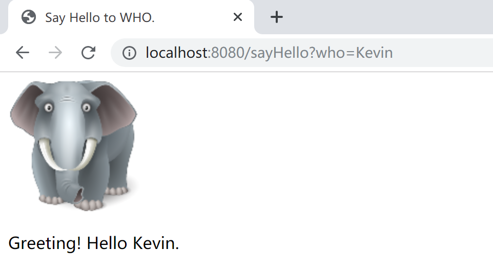

## 4.2 Thymeleaf介绍

开发传统Java WEB应用时，如上一小节说介绍的，我们可以使用JSP页面模板语言。但是由于JSP的众多缺点，在SpringBoot中已经不推荐使用了。

SpringBoot官方推荐使用Thymeleaf模板语言。

> Thymeleaf是一种用于Web和独立环境的现代服务器端的Java模板引擎。
>
> Thymeleaf的主要目标是将优雅的自然模板带到开发工作流程中，并将HTML在浏览器中正确显示，并且可以作为静态原型，让开发团队能更容易地协作。
>
> Thymeleaf能够处理HTML，XML，JavaScript，CSS甚至纯文本。 

当前，在实际工作中，一般都是通过Spring Boot使用Spring MVC，为前端（如vue页面，或手机app）提供服务调用接口。Spring Boot的`spring-boot-starter-web`启动器为开发者提供了大量的**基于约定的**配置。

在添加`spring-boot-starter-thymeleaf`启动器的情况下，Spring Boot使用Thymeleaf作为前端模板。

下面我们结合项目代码来学习如何在Spring Boot中使用Thymeleaf这个模板引擎。

首先创建一个web+thymeleaf的Spring Boot应用。


pom文件中最重要的两个starter依赖如下：

```xml
<dependency>
    <groupId>org.springframework.boot</groupId>
    <artifactId>spring-boot-starter-thymeleaf</artifactId>
</dependency>
<dependency>
    <groupId>org.springframework.boot</groupId>
    <artifactId>spring-boot-starter-web</artifactId>
</dependency>
```

创建一个Controller，复用上一小节中的HelloController代码。

```java
package com.example.thymeleaf.controller;

import org.springframework.stereotype.Controller;
import org.springframework.web.bind.annotation.RequestMapping;
import org.springframework.web.servlet.ModelAndView;

@Controller
public class HelloController {
	
	@RequestMapping("/sayHello")
	public ModelAndView sayHello(String who) {
		ModelAndView mv = new ModelAndView();
		//模拟调用Service方法，返回问候语sayHello
		String sayHello = "Greeting! Hello ";
		mv.addObject("sayHello", sayHello + who + ".");
		mv.setViewName("/hello");
		return mv;
	}

}
```

将一张图片（例如RoyElephant.png）拷贝到项目的`src/main/resources/static/images`目录下（需要在static下先创建images目录）。

在`/src/main/resources/templates`目录下创建一个hello.html文件，其使用了Thymeleaf模板语法。

```html
<!DOCTYPE html>
<html xmlns:th="http://www.thymeleaf.org">
<head>
<title>Say Hello to WHO.</title>
<meta http-equiv="Content-Type" content="text/html;charset=UTF-8"/>
</head>
<body>
	
	<p th:text="${sayHello}"/>
</body>
</html>
```

注意上面代码中的`th:src`和`th:text`，这会使这个页面在服务器端使用Thymeleaf模板技术进行最后的html文件输出。

打开浏览器，访问 [ http://localhost:8080/sayHello?who=Kevin ]( http://localhost:8080/sayHello?who=Kevin ) ，可以看到，Thymeleaf能够正常工作。



Spring Boot在使用Spring MVC的时候约定了如下两位目录位置：

- 静态资源位置：`src/main/resources/static`，其下存放图片、css、js等内容；
- 模板文件位置：`/src/main/resources/templates`，其下存放使用th（thymeleaf）标签的html文件。

由于在实际工作中，前后端分离架构的广泛使用，Thymeleaf作为Spring MVC的一种服务端模板技术，能用到的机会还是比较少的。所以我们在这里仅仅是简单得介绍Spring Boot如何使用这个模板技术，更多Thymeleaf的用法，请在需要的时候查阅[官方文档](https://www.thymeleaf.org/doc/tutorials/3.0/usingthymeleaf.html)了解（拷贝其中得代码，供你的项目使用）。