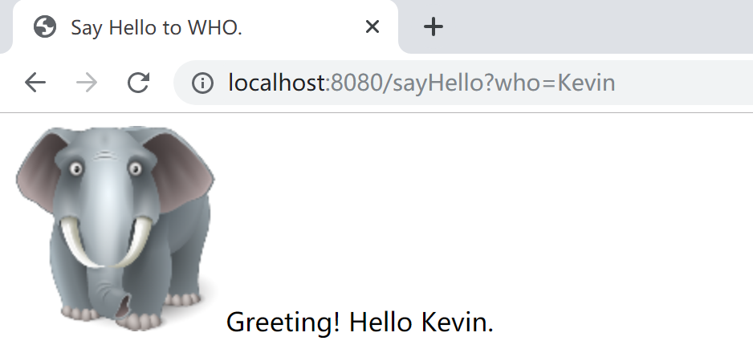
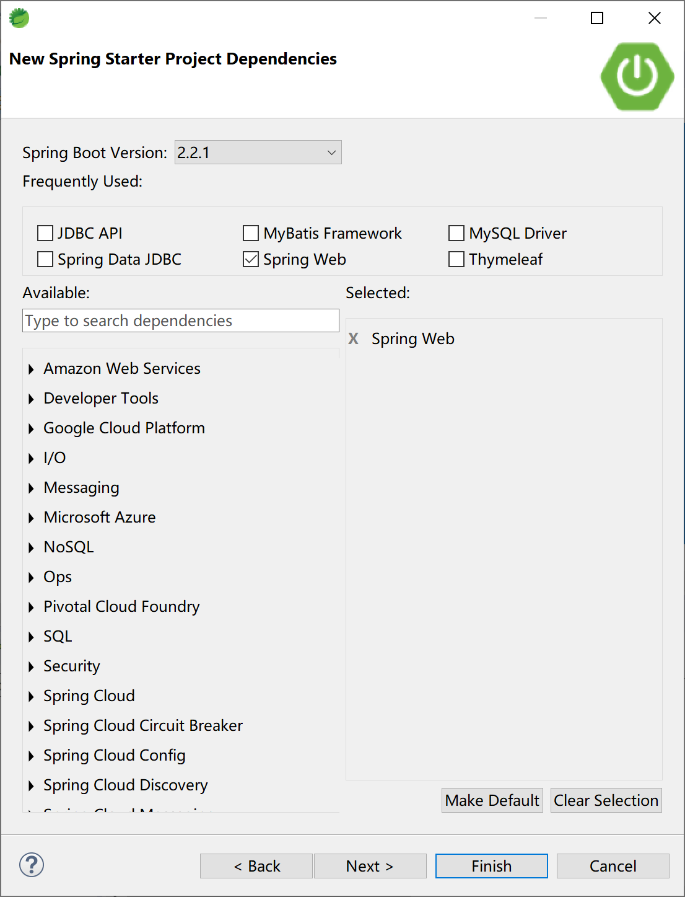
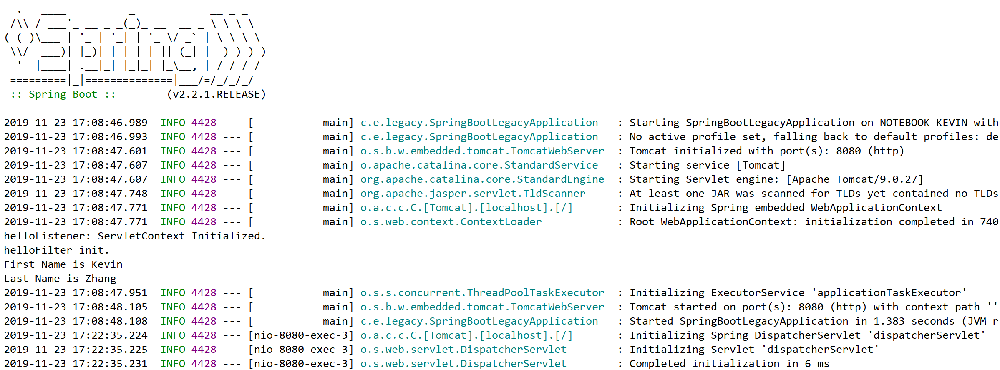
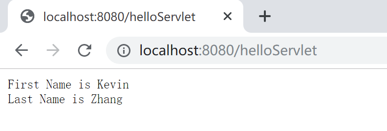

## 4.3 使用Servlet、Listener和Filter

在某些特定的业务场景下，我们可能会对已有的遗留项目进行改造、集成。而这些项目是使用传统Java web技术开发的，其中大量涉及了JSP和Servlet规范，而我们并不能去彻底改造它们，只能集成延用。

或者，我们也会遇到在Spring Boot应用中新开发Servlet之类的需求。

Spring Boot为这些古老的技术规范提供了一定的支持，能够完美的沿用遗留的业务逻辑代码或新建业务逻辑代码（Servlet）。

本小节，我们通过在Spring MVC中使用Thymeleaf技术来学习如何在Spring Boot中使用传统的Servlet、Listener和Filter技术。

### 4.3.1 Servlet

Java Servlet 是运行在 Web 服务器或应用服务器上的程序，它是作为来自 Web 浏览器或其他 HTTP 客户端的请求和 HTTP 服务器上的数据库或应用程序之间的中间层。

使用 Servlet，您可以收集来自网页表单的用户输入，呈现来自数据库或者其他源的记录，还可以动态创建网页。

Java Servlet 通常情况下与使用 CGI（Common Gateway Interface，公共网关接口，一种古老的技术）实现的程序可以达到异曲同工的效果。但是相比于 CGI，Servlet 有以下几点优势：

- 性能明显更好。
- Servlet 在 Web 服务器的地址空间内执行。这样它就没有必要再创建一个单独的进程来处理每个客户端请求。
- Servlet 是独立于平台的，因为它们是用 Java 编写的。
- 服务器上的 Java 安全管理器执行了一系列限制，以保护服务器计算机上的资源。因此，Servlet 是可信的。
- Java 类库的全部功能对 Servlet 来说都是可用的。它可以通过 sockets 和 RMI 机制与 applets、数据库或其他软件进行交互。

最新的Servlet规范是4.01(JSR 369)，但是当前使用最多的是 JavaEE7 Servlet 3.1 (JSR 340)。Tomcat 8.0开始支持Servlet 3.1规范。

在Spring Boot中使用遗留Sevlet，可以通过`ServletRegistrationBean`注册。

```java
@Bean
public ServletRegistrationBean<HelloServlet> registerServlet() {
    ServletRegistrationBean<HelloServlet> servletRegistrationBean = new ServletRegistrationBean<HelloServlet>(
        new HelloServlet(), "/helloServlet");
    servletRegistrationBean.addInitParameter("firstName", "Kevin");
    servletRegistrationBean.addInitParameter("lastName", "Zhang");
    return servletRegistrationBean;
}	
```

当然，也可以使用**Servlet 3.0+**规范的注解方式来开发Servlet，然后配置组件扫描，将其注册到Servlet容器（例如，Tomcat）中。


如上图所示，**Servlet 3.0+**规范开始提供了这 3 个注解来代替：

- **@WebServlet** => 代替 servlet 配置；

- **@WebFilter** => 代替 filter 配置；

- **@WebListener** => 代替 listener 配置。

```java
package com.example.legacy.servlet;

import java.io.IOException;

import javax.servlet.annotation.WebInitParam;
import javax.servlet.annotation.WebServlet;
import javax.servlet.http.HttpServlet;
import javax.servlet.http.HttpServletRequest;
import javax.servlet.http.HttpServletResponse;

@WebServlet(name = "anotherServlet", urlPatterns = "/anotherServlet", asyncSupported = true, initParams = {
		@WebInitParam(name = "firstName", value = "Roy"), @WebInitParam(name = "lastName", value = "Zhang") })
public class AnotherServlet extends HttpServlet {

	private static final long serialVersionUID = 2734212784679009034L;
    
	@Override
    protected void service(HttpServletRequest req, HttpServletResponse resp) throws IOException {
        String firstName = getServletConfig().getInitParameter("firstName");
        String lastName = getServletConfig().getInitParameter("lastName");

        resp.getOutputStream().println("First Name is " + firstName);
        resp.getOutputStream().println("Last Name is " + lastName);
    }

}
```

正确运行后的效果如下图所示：


需要注意的是，为了安全考虑，内嵌服务器不会直接执行 Servlet 3.0 里面的 `javax.servlet.ServletContainerInitializer` 接口，或者 Spring 中的 `org.springframework.web.WebApplicationInitializer` 接口，否则会导致终止 Spring Boot 应用。

所以，如果使用的是 Spring Boot 内嵌服务器，需要在配置类（Spring Boot的启动类也是一个配置类，简单示例中可以将其添加到启动类）上添加额外的 `@ServletComponentScan` 注解来开启 Servlet 组件扫描功能。如果使用的是独立的服务器，则不需要添加，会使用服务器内部的自动发现机制。

### 4.3.2 Listerner

监听器用于监听Web应用中某些对象的创建、销毁、增加，修改，删除等动作，然后作出相应的处理。当监听范围的对象的状态发生变化的时候，服务器自动调用监听器对象中的方法。常用于统计网站在线人数、系统加载时进行信息初始化、统计网站的访问量等等。 

Servlet规范中的监听器可分为三类：

- ServletContext对象的监听器；
- HttpSession对象的监听器；
- ServletRequest对象的监听器。

例如，下面是一个ServletContext监听器示例，其监听了Servlet容器的建立和销毁事件。

```java
package com.example.legacy.listener;

import javax.servlet.ServletContextEvent;
import javax.servlet.ServletContextListener;

public class HelloListener implements ServletContextListener {
	@Override
	public void contextInitialized(ServletContextEvent servletContextEvent) {
		System.out.println("helloListener: ServletContext Initialized.");
	}

	@Override
	public void contextDestroyed(ServletContextEvent servletContextEvent) {
		System.out.println("helloListener: ServletContext Destroyed.");
	}

}
```

在Spring Boot中，和Servlet类似，可以用`ServletListenerRegistrationBean`将其注册到web容器中。

```java
@Bean
public ServletListenerRegistrationBean<HelloListener> registerListener() {
    ServletListenerRegistrationBean<HelloListener> listenerRegistrationBean = new ServletListenerRegistrationBean<HelloListener>(
        new HelloListener());
    listenerRegistrationBean.setOrder(1);
    return listenerRegistrationBean;
}
```

其运行效果，如下图所示：


### 4.3.3 Filter

过滤器可以动态地拦截请求和响应，以转换或使用包含在请求或响应中的信息。

可以将一个或多个 Servlet 过滤器附加到一个 Servlet 或一组 Servlet。Servlet 过滤器也可以附加到 JavaServer Pages (JSP) 文件和 HTML 页面。调用 Servlet 前会调用所有附加的 Servlet 过滤器。

Servlet 过滤器是可用于 Servlet 编程的 Java 类，可以实现以下目的：

- 在客户端的请求访问后端资源之前，拦截这些请求。
- 在服务器的响应发送回客户端之前，处理这些响应。

根据规范建议的各种类型的过滤器：

- 身份验证过滤器（Authentication Filters）。
- 数据压缩过滤器（Data compression Filters）。
- 加密过滤器（Encryption Filters）。
- 触发资源访问事件过滤器。
- 图像转换过滤器（Image Conversion Filters）。
- 日志记录和审核过滤器（Logging and Auditing Filters）。
- MIME-TYPE 链过滤器（MIME-TYPE Chain Filters）。
- 标记化过滤器（Tokenizing Filters）。
- XSL/T 过滤器（XSL/T Filters），转换 XML 内容。

在以前，过滤器通过 Web 部署描述符（web.xml）中的 XML 标签来声明，然后映射到您的应用程序的部署描述符中的 Servlet 名称或 URL 模式。

当 Web 容器启动 Web 应用程序时，它会为您在部署描述符中声明的每一个过滤器创建一个实例。

Filter的执行顺序与在web.xml配置文件中的配置顺序一致，一般把Filter配置在所有的Servlet之前。

例如，下面是一个过滤器的代码。

```java
package com.example.legacy.filter;

import java.io.IOException;

import javax.servlet.Filter;
import javax.servlet.FilterChain;
import javax.servlet.FilterConfig;
import javax.servlet.ServletException;
import javax.servlet.ServletRequest;
import javax.servlet.ServletResponse;

public class HelloFilter implements Filter {

    @Override
    public void init(FilterConfig filterConfig) throws ServletException {
        System.out.println("helloFilter init.");
        String firstName = filterConfig.getInitParameter("firstName");
        String lastName = filterConfig.getInitParameter("lastName");
        System.out.println("First Name is " + firstName);
        System.out.println("Last Name is " + lastName);
    }

	@Override
	public void doFilter(ServletRequest request, ServletResponse response, FilterChain chain)
			throws IOException, ServletException {
        System.out.println("helloFilter processing.");
        chain.doFilter(request, response);
	}

}
```

在Spring Boot中，用`FilterRegistrationBean`将其注册到web容器中。

```java
@Bean
public FilterRegistrationBean<HelloFilter> registerFilter() {
    FilterRegistrationBean<HelloFilter> filterRegistrationBean = new FilterRegistrationBean<HelloFilter>(
        new HelloFilter());
    filterRegistrationBean.setName("helloFilter");
    filterRegistrationBean.setOrder(1);
    filterRegistrationBean.addUrlPatterns("/");
    filterRegistrationBean.addInitParameter("firstName", "Kevin");
    filterRegistrationBean.addInitParameter("lastName", "Zhang");
    return filterRegistrationBean;
}
```

其运行效果，如下图所示：


### 4.3.4 JSP

JSP 与 PHP、ASP、ASP.NET 等语言类似，是一种运行在服务端的视图技术语言。

JSP（全称Java Server Pages）是由 Sun Microsystems 公司倡导和许多公司参与共同创建的一种使软件开发者可以响应客户端请求，而动态生成 HTML、XML 或其他格式文档的Web网页的技术标准。

JSP 技术是以 Java 语言作为脚本语言的，JSP 网页为整个服务器端的 Java 库单元提供了一个接口来服务于HTTP的应用程序。JSP文件后缀名为 ***.jsp** 。

JSP开发的WEB应用可以跨平台使用，既可以运行在 Linux 上也能运行在 Windows 上。

当前，越来越多的项目使用前后端分离技术构建，JSP使用场景越来也少。但是，在某些特殊场景下，需要将使用JSP技术（一般也会同时使用Servlet技术）的遗留系统整合到Spring Boot应用中来，例如整合BIRT开源报表。

在Spring Boot中，使用JSP，首先需要在pom文件中添加 JSP编译器。 

```xml
<dependency>
    <groupId>org.apache.tomcat.embed</groupId>
    <artifactId>tomcat-embed-jasper</artifactId>
</dependency>
```

然后，为Spring MVC配置JSP视图解析器的前缀后缀。

```properties
spring.mvc.view.prefix=/WEB-INF/jsp/
spring.mvc.view.suffix=.jsp
```

接下来，创建`/src/main/webapp/WEB-INF/jsp`目录，并在其下创建一个JSP文件hello.jsp。

```jsp
<%@ page language="java" contentType="text/html; charset=UTF-8" pageEncoding="UTF-8"%>
<!DOCTYPE html>
<html>
<head>
<meta charset="UTF-8">
<title>Say Hello to WHO.</title>
</head>
<body>
	/images/RoyElephant.png" width="128" height="128" />
	${sayHello}
</body>
</html>
```

在`/src/main/resources/static/images`下放置图片文件RoyElephant.png，供JSP文件访问静态资源演示用。

最后，创建一个Controller，拦截http请求，并通过JSP页面返回结果。

```java
package com.example.legacy.controller;

import org.springframework.stereotype.Controller;
import org.springframework.web.bind.annotation.RequestMapping;
import org.springframework.web.servlet.ModelAndView;

@Controller
public class HelloController {
	
	@RequestMapping("/sayHello")
	public ModelAndView sayHello(String who) {
		ModelAndView mv = new ModelAndView();
		//模拟调用Service方法，返回问候语sayHello
		String sayHello = "Greeting! Hello ";
		mv.addObject("sayHello", sayHello + who + ".");
		mv.setViewName("/hello");
		return mv;
	}

}
```

最后返回的页面结果如下图所示：



### 4.3.5 Spring Boot集成示例

创建一个Spring Boot项目，选中**Spring MVC**依赖。



由于需要使用JSP，就要在pom文件中增加`tomcat-embed-jasper`这个JSP编译器。

```xml
<dependency>
    <groupId>org.springframework.boot</groupId>
    <artifactId>spring-boot-starter-web</artifactId>
</dependency>
<dependency>
    <groupId>org.apache.tomcat.embed</groupId>
    <artifactId>tomcat-embed-jasper</artifactId>
</dependency>
```

在配置文件`application.properties`中，为JSP视图解析器设置前缀后缀属性。

```properties
spring.mvc.view.prefix=/WEB-INF/jsp/
spring.mvc.view.suffix=.jsp
```

创建JSP文件hello.jsp和控制器HelloController。在`/src/main/resources/static/images`下放置图片文件RoyElephant.png。

创建HelloServlet、HelloFilter和HelloListener类（代码请参考本小节前面的示例代码）。

在启动类中注册上面创建的HelloServlet、HelloFilter和HelloListener类。

在启动类中添加`@ServletComponentScan`注解，以扫描`AnotherServlet`类。

启动应用程序，观察运行结果。



访问 [localhost:8080/helloServlet](http://localhost:8080/helloServlet) ，检查Servlet输出结果。



