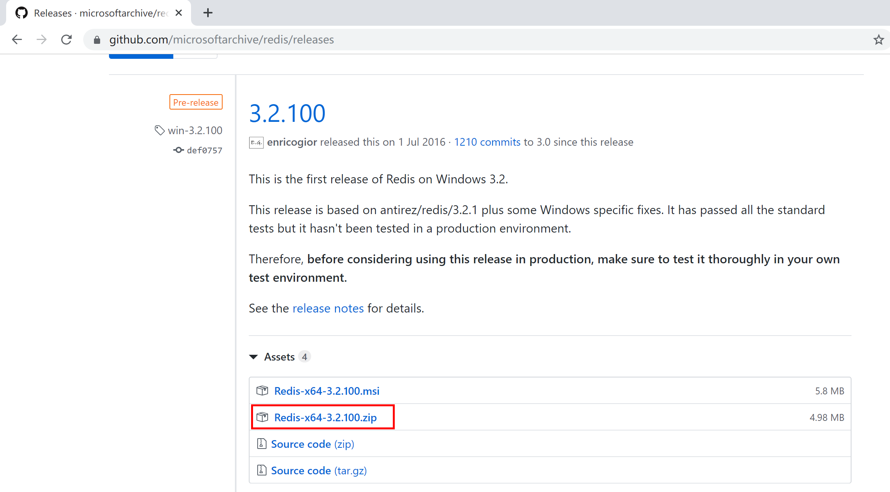

## 7.1 Redis简介

Redis 是一个开源（BSD许可）的，内存中的数据结构存储系统，它可以用作数据库、缓存和消息中间件。 它支持多种类型的数据结构，如 字符串（strings），散列（hashes），列表（lists），集合（sets），有序集合（sorted sets）与范围查询，bitmaps，hyperloglogs和地理空间（geospatial）索引半径查询。 Redis 内置了复制（replication），LUA脚本（Lua scripting），LRU驱动事件（LRU eviction），事务（transactions）和不同级别的磁盘持久化（persistence），并通过Redis哨兵（Sentinel）和自动分区（Cluster）提供高可用性（high availability）。 

正是因为上述特性，在企业环境中，Redis被大量使用。

Redis是以源码方式发布的，在Linux、Mac下都需要本地编译后使用。官方并不支持Windows版本，而且在生产环境下也少有见到在Windows下使用Redis的。

在学习过程中，为了简化环境起见，我们选择在Windows下安装Redis预编译版本。

根据Redis官方文档所述，其[支持8中数据类型](https://redis.io/topics/data-types-intro)，本小节我们介绍经常使用到的前5种数据类型。

> - Binary-safe strings.
> - Lists: collections of string elements sorted according to the order of insertion. They are basically *linked lists*.
> - Sets: collections of unique, unsorted string elements.
> - Sorted sets, similar to Sets but where every string element is associated to a floating number value, called *score*. The elements are always taken sorted by their score, so unlike Sets it is possible to retrieve a range of elements (for example you may ask: give me the top 10, or the bottom 10).
> - Hashes, which are maps composed of fields associated with values. Both the field and the value are strings. This is very similar to Ruby or Python hashes.
> - Bit arrays (or simply bitmaps): it is possible, using special commands, to handle String values like an array of bits: you can set and clear individual bits, count all the bits set to 1, find the first set or unset bit, and so forth.
> - HyperLogLogs: this is a probabilistic data structure which is used in order to estimate the cardinality of a set. Don't be scared, it is simpler than it seems... See later in the HyperLogLog section of this tutorial.
> - Streams: append-only collections of map-like entries that provide an abstract log data type. They are covered in depth in the [Introduction to Redis Streams](https://redis.io/topics/streams-intro).

### 7.1.1 安装

在[https://github.com/microsoftarchive/redis/releases](https://github.com/microsoftarchive/redis/releases) 这里下载Windows预编译版本的Redis，为了简便起见，我们选择解压包文件。

下载后，将其解压到用户目录中，例如`C:\Users\Kevin\Redis-x64-3.2.100`。

双击`redis-server.exe`运行Redis服务器，可以看到Redis服务在6379端口上已经开放了。

### 7.1.2 测试

双击`redis-cli.exe`启动Redis客户端，确定其已经连接到本地Redis服务。

#### 7.1.2.1 字符串的增删改查

输入命令`set name 'Kevin'`在Redis中增加一个Key-Vaule记录，并使用`get name`查询对应的值，如下：

输入命令`set name 'Roy'`，将name更新为Roy，然后再查询其值，如下：

输入命令`del name`，删除name的值，然后使用查询`get name`，返回nil。

我们用`exists name`命令检查name这个key是否再Redis中存在，返回0表示不存在，也就是说上面的删除命令是正确执行了的。

#### 7.1.2.2 List集合的增删改查

Redis列表是简单的字符串列表，按照插入顺序排序。你可以添加一个元素到列表的头部（左边）或者尾部（右边）。

一个列表最多可以包含 2^32 - 1 个元素（40多亿）。

输入命令`lpush userList 'Kevin' 'Roy'`，Redis返回2，说明其存入了两个值。

输入命令`lrange userList 0 -1`，可以查询到userList这个List中的所有元素。

输入命令`rpush userList 'GoodMan'`，往List的尾部增加一个元素。

输入命令`lpush userList 'Wonderful'`，往List的头部增加一个元素。

然后查询所有的List元素，确认Wonderful增加在头部，GoodMan追加在尾部。

输入命令`lset userList 1 'Roy Zhang'`，将List中的第2个元素（Roy）更新为“Roy Zhang”，查询List确认是否正确修改。

输入命令`lrem userList 0 'Wonderful'`，删除List中的第1个元素，并查询确认。

#### 7.1.2.3 Set集合的增删改查

Redis 的 Set 是 String 类型的无序集合。集合成员是唯一的，这就意味着集合中不能出现重复的数据。

Redis 中集合是通过哈希表实现的，所以添加，删除，查找的复杂度都是 O(1)。

集合中最大的成员数为 2^32 - 1（40多亿）。

输入命令`sadd userSet 'Kevin' 'Roy' 'GoodMan'`，往userSet中添加3个元素。

然后执行命令`smembers userSet`命令，查询userSet这个Set集合中的元素。

输入命令`srem userSet 'GoodMan'`，删除userSet中的“GoodMan”元素。

输入命令`sadd userSet 'Wonderful'`，往userSet这个Set集合中添加“Wonderful”元素。查询后发现新加入的元素添加到了第2位，当然，只是显示问题，Set中的元素本来就没有顺序。

输入命令`sadd userSet 'Kevin'`，Redis返回0，是因为userSet中本来就有“Kevin”这个元素，所有无法再次添加。

#### 7.1.2.4 Hash集合的增删改查

Redis Hash 是一个 string 类型的 field 和 value 的映射表，hash 特别适合用于存储对象。

Redis 中每个 hash 可以存储 2^32 - 1 键值对（40多亿）。

输入命令`hset userHset 'user1' 'Kevin'`创建Key为userHset的hash集合，往其中添加一条记录：字段为user1，值为Kevin，Redis返回添加成功的记录数为1。

输入命令`hset userHset 'user2' 'Roy'`，往userHset中添加第2条记录。

使用命令`hlen userHset`查询Hash集合的记录数，此处应该返回2条。

输入命令`hkeys userHset`查询Hash集合中所有的字段（Key）。

输入命令`hvals userHset`查询Hash集合中所有的值（Value）。

输入命令`hgetall userHset`查询userHset这个哈希集合中的所有字段和值（Key Value）。

输入命令`hget userHset 'user1'`查询userHset这个哈希集合中Key为user1所对应的值（Value）。

输入命令`hset userHset 'user1' 'Kevin Zhang'`更新userHset这个哈希集合中Key为user1所对应的值（Value），注意Redis返回0，说明删除操作并不会往Redis中增加记录。

然后使用命令`hget userHset 'user1'`查询user1，检查值是否被更改。

输入命令`hdel userHset user1`在userHset这个哈希集合中删除user1和对应的值（当前为Kevin Zhang），Redis返回1，说明删除了一个Key-Value值对。

然后使用命名`hgetall userHset`检查是否删除成功。

#### 7.1.2.5 Sorted Set集合的增删改查

Redis 有序集合和集合一样也是string类型元素的集合，且不允许重复的成员。

不同的是每个元素都会关联一个double类型的分数。redis正是通过分数来为集合中的成员进行从小到大的排序。

有序集合的成员是唯一的，但分数(score)却可以重复。

集合是通过哈希表实现的，所以添加，删除，查找的复杂度都是O(1)。 集合中最大的成员数为 2^32 - 1（40多亿）。

输入命令`zadd userZset 1 'Kevin'`，为userZset添加成员Kevin，分数为1。

输入命令`zadd userZset 2 'Roy'`，为userZset添加成员Roy，分数为2。

输入命令`zrange userZset 0 -1`按照分数从小到大查询集合中的元素。

输入命令`zrevrange userZset 0 -1`按照分数从大到小查询集合中的元素。

输入命令`zscore userZset 'Kevin'`查询Kevin这个元素的分数。

输入命令`zrem userZset 'Kevin'`删除集合中的Kevin这个元素。

