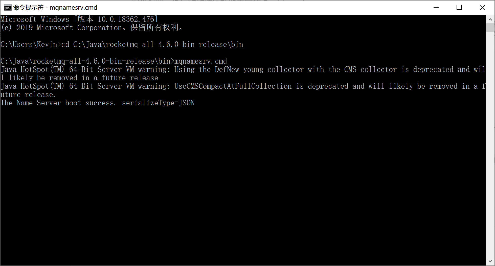

## 9.4 Spring Boot集成RocketMQ

RocketMQ是由阿里巴巴开源到Apache的一个Java语言的分布式消息中间件，支持事务消息、顺序消息、批量消息、定时消息、消息回溯等。它里面有几个区别于标准消息中件间的概念，如Group、Topic、Queue等。系统组成则有Producer、Consumer、Broker、NameServer等。


RocketMQ的主要特点：

- 支持发布/订阅（Pub/Sub）和点对点（P2P）消息模型。
- 在一个队列中可靠的先进先出（FIFO）和严格的顺序传递 （RocketMQ可以保证严格的消息顺序，而ActiveMQ无法保证）。
- 支持拉（pull）和推（push）两种消息模式 （Push好理解，比如在消费者端设置Listener回调；而Pull，控制权在于应用，即应用需要主动的调用拉消息方法从Broker获取消息，这里面存在一个消费位置记录的问题（如果不记录，会导致消息重复消费））。
- 单一队列百万消息的堆积能力（RocketMQ提供亿级消息的堆积能力，这不是重点，重点是堆积了亿级的消息后，依然保持写入低延迟）。
- 支持多种消息协议，如 JMS、MQTT 等。
- 分布式高可用的部署架构，满足至少一次消息传递语义（RocketMQ原生就是支持分布式的，而ActiveMQ原生存在单点性）。
- 提供 docker 镜像用于隔离测试和云集群部署。
- 提供配置、指标和监控等功能丰富的 Dashboard。

RocketMQ以Topic来管理不同应用的消息，对于生产者（producer）而言，发送消息时需要指定消息的Topic，对于消费者（consumer）而言，在启动后需要订阅相应的Topic，然后可以消费相应的消息。Topic是逻辑上的概念，在物理实现上，一个Topic由多个Queue组成，采用多个Queue的好处是可以将Broker存储分布式化，提高系统性能。

本小节介绍如何安装配置高可用的RocketMQ集群，在Spring Boot中集成使用。

### 9.4.1 单机安装配置

到[官网](http://rocketmq.apache.org/)下载最新版本[rocketmq-all-4.6.0-bin-release.zip](https://www.apache.org/dyn/closer.cgi?path=rocketmq/4.6.0/rocketmq-all-4.6.0-bin-release.zip)，然后解压到磁盘，例如`C:\Java\rocketmq-all-4.6.0-bin-release`。

在Windows的环境变量中配置ROCKETMQ_HOME到RocketMQ的解压目录，例如`C:\Java\rocketmq-all-4.6.0-bin-release`。

**[rocketmq-externals](https://github.com/apache/rocketmq-externals)**项目由社区维护了很多RocketMQ相关的扩展/集成支持，其中的rocketmq-console子项目是一个可视化的管理控制台。

执行git clone命令，将项目版本库克隆到本地。

```bash
git clone https://github.com/apache/rocketmq-externals.git
```

进入rocketmq-console子项目的目录，maven编译。

```bash
mvn clean package -Dmaven.test.skip=true
```

进入target目录执行java -jar命令，启动RocketMQ管理控制台。

```bash
java -jar target/rocketmq-console-ng-1.0.1.jar
```

TODO：控制台截图，github太慢了，明天下载


执行bin目录下的mqnamesrv.cmd，启动name server。

```powershell
C:\Java\rocketmq-all-4.6.0-bin-release\bin>mqnamesrv.cmd
```



执行bin目录下的mqbroker.cmd，启动BROKER。

```powershell
C:\Java\rocketmq-all-4.6.0-bin-release\bin>mqbroker.cmd -n 127.0.0.1:9876 autoCreateTopicEnable=true
```


TOTO：连接到控制台截图

### 9.4.2 高可用集群


### 9.4.3 与Spring Boot集成

为了方便在Spring Boot中集成RocketMQ，官方提供了Spring Boot的starter。

新建Spring Boot项目，添加Spring Web启动器依赖。

> Spring  Boot官方没有提供RocketMQ的starter，由RocketMQ官方提供starter，从`rocketmq-spring-boot-starter`命名上可以看出来，和MyBatis的命令类似。


然后，在pom文件中手工添加RocketMQ的启动器依赖。

```xml
<dependency>
    <groupId>org.apache.rocketmq</groupId>
    <artifactId>rocketmq-spring-boot-starter</artifactId>
    <version>2.0.4</version>
</dependency>
```

在application.yml文件中，添加到RocketMQ的连接信息。

```yml
rocketmq:
  name-server: 127.0.0.1:9876
  producer:
    send-message-timeout: 300000
    group: my-group
```

创建消息提供者RocketProducer，注入RocketMQTemplate类。

```java
package com.example.rocketmq.producer;

import org.apache.rocketmq.spring.core.RocketMQTemplate;
import org.springframework.beans.factory.annotation.Autowired;
import org.springframework.stereotype.Component;

@Component
public class RocketProducer {
	
	@Autowired
	private RocketMQTemplate rocketMQTemplate;
	
	public void sendMessage(String msg) {
		rocketMQTemplate.convertAndSend("test-topic",msg);
	}

}
```

创建消息消费者RocketConsumer，实现RocketMQListener接口。

使用@RocketMQMessageListener注解，连接到RocketMQ的test-topic主题，监听消息。

```java
package com.example.rocketmq.consumer;

import org.apache.rocketmq.spring.annotation.RocketMQMessageListener;
import org.apache.rocketmq.spring.core.RocketMQListener;
import org.springframework.stereotype.Component;

@Component
@RocketMQMessageListener(consumerGroup = "my-consumer_test-topic", topic = "test-topic")
public class RocketConsumer implements RocketMQListener<String> {

	@Override
	public void onMessage(String message) {
		System.out.println("RocketMQ Consumer consume message: " + message);
	}

}
```

创建控制器RocketController类，和用户交互，向RocketMQ发送消息。

```java
package com.example.rocketmq.controller;

import org.springframework.beans.factory.annotation.Autowired;
import org.springframework.web.bind.annotation.RequestMapping;
import org.springframework.web.bind.annotation.RestController;

import com.example.rocketmq.producer.RocketProducer;

@RestController
@RequestMapping("/rocketmq/")
public class RocketController {

	@Autowired
	RocketProducer rocketProducer;
	
	@RequestMapping("/send")
	public String sendMsg(String msg) {
		rocketProducer.sendMessage(msg);
		return msg + " Sended to test-topic.";
	}
}
```

按照9.4.1小节中的单机RocketMQ服务器启动，然后启动Spring Boot应用。

```powershell
C:\Java\rocketmq-all-4.6.0-bin-release\bin>mqnamesrv.cmd
C:\Java\rocketmq-all-4.6.0-bin-release\bin>mqbroker.cmd -n 127.0.0.1:9876 autoCreateTopicEnable=true
```

打开浏览器，输入[http://localhost:8080/rocketmq/send?msg=Kevin is a GOODMAN.](http://localhost:8080/rocketmq/send?msg=Kevin is a GOODMAN.)，向RocketMQ发送消息。


观察Spring Boot的控制台，检查消息消费者通过System.out打印出来的消息。


