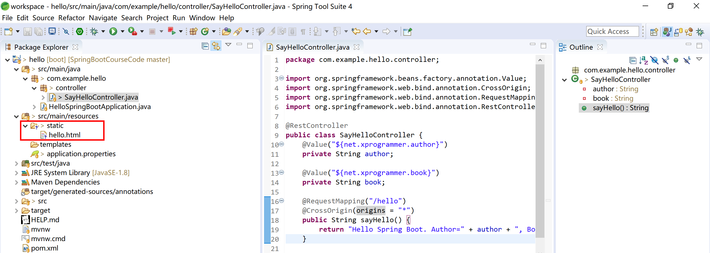

## A.4 前后端分离的部署

前后端分离部署，一般前端会部署在Nginx（或Apache Httpd）上。后端部署在Tomcat上或Spring Boot的Fat Jar（含内嵌Tomcat服务器）直接部署。

在某种情况下，我们为了架构统一，使用前后端分离的方式开发的应用，又需要部署把前后端部署在一个Fat Jar包中。

> 比如，使用统一开发平台开发的产品，有的客户规模大，是前端后端分布式微服务化部署。有的客户规模下，采用单体架构部署。

### A.4.1 前端部署

将开发好的前端页面（如html及其js、图片等），部署到web服务器中，例如下图的Tomcat（不推荐前端用Tomcat，这里只是为了方便学习，不引入过多的技术）。

然后启动前端服务器，就可以供客户访问了。

### A.4.2 后端部署

Spring Boot中打包可执行的Fat Jar，内嵌Tomcat服务器，直接通过`java -jar`命令启动服务器。

### A.4.3 退化为单体部署

将开发完成的前端资源（html、js、图片等）拷贝到后端Spring Boot应用的`/src/main/resources/static`下，然后再导出可执行jar包（含内嵌服务器）或war包（可部署到指定的服务器下）。

